<div align="center">

[English](README.md)

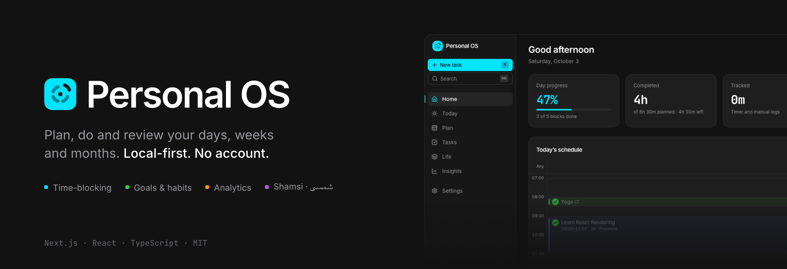

**یک سیستم‌عامل آرام و لوکال‌فرست برای برنامه‌ریزی، انجام و مرور روزها، هفته‌ها و ماه‌های شما.**

Plan → Execute → Track → Review → Adjust. برنامه‌ها فرضیه‌اند: جابه‌جا کردن یک کار عادی است، نه شکست.

[](https://nextjs.org)
[](https://react.dev)
[](https://www.typescriptlang.org)
[](https://tailwindcss.com)
[](#-دادههای-شما)
[](#-تقویم-شمسی--فارسی)
[](#-تستها)
[](LICENSE)
[](https://github.com/Mapl6/personal-os/stargazers)

**[▶ نسخه نمایشی زنده](https://personal-os-nine-lime.vercel.app/?demo=1)** · [باز کردن اپ](https://personal-os-nine-lime.vercel.app) · [نقشه راه عمومی](https://personal-os-nine-lime.vercel.app/roadmap)

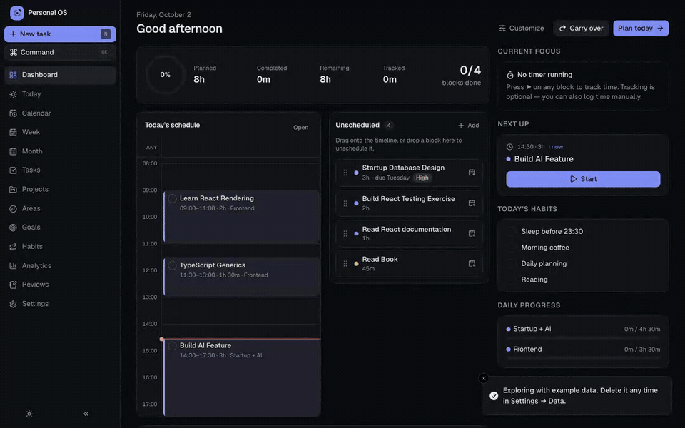

</div>

---

## چرا

بیشتر اپ‌های بهره‌وری یا یک تقویم خشک‌اند یا یک لیست بی‌پایان کار، و هر دو وقتی زندگی برنامه را به‌هم می‌زند بی‌سر و صدا تنبیه‌تان می‌کنند. **Personal OS** با برنامه مثل چیزی رفتار می‌کند که باید تنظیمش کرد. برای یک روتین تمام‌وقت خودتوسعه‌ای ساخته شده (یادگیری، پروژه‌های جانبی، استارتاپ، سلامت، کتاب، استراحت) و کمک‌تان می‌کند به این سؤال‌ها جواب بدهید:

- امروز قرار است چه کار کنم و بعدش چی؟
- واقعاً چقدر وقت گذاشتم و کجا رفت؟
- بین یادگیری، کار، سلامت و زندگی تعادل را حفظ می‌کنم؟
- هفته آینده چه چیزی را باید عوض کنم؟

برای **ثبات، شفافیت، انعطاف، برنامه‌ریزی واقع‌بینانه و پیشرفت بلندمدت** بهینه شده، نه برای به حداکثر رساندن تیک‌ها.

## ✨ ویژگی‌ها

| | |
|---|---|
| 🗓️ **زمان‌بندی منعطف** | کارها را روی تایم‌لاین بکشید، بلاک‌ها را به ساعت یا روز دیگری منتقل کنید، با کشیدن لبه تغییر اندازه بدهید، یک کار ۲ ساعته را به ۱ ساعت امروز و ۱ ساعت فردا تقسیم کنید و سشن‌ها را دوباره ادغام کنید. خودِ کار هرگز تکراری نمی‌شود. |
| ☀️ **امروز** | تایم‌لاین در دسکتاپ، لیستی با دکمه‌های لمسی بزرگ در موبایل و یک مخزن کارهای زمان‌بندی‌نشده در کنار. تکمیل، شروع تایمر، رد کردن، زمان‌بندی مجدد، ویرایش یا حذف، مستقیم از روی هر بلاک. |
| 📅 **تقویم** | نماهای روزانه، هفتگی و ماهانه با درگ‌انددراپ، ساخت با کلیک، تغییر اندازه و میانبرهای صفحه‌کلید (`←/→`، `D/W/M`، `T`). |
| 📊 **هفته و ماه** | ساعت‌های برنامه‌ریزی‌شده در برابر انجام‌شده برای هر روز، پیشرفت اهداف هفتگی، **قالب‌های هفته** قابل استفاده مجدد (پیشنهاد ← بازبینی ← اعمال)، اهداف ماهانه، مایل‌استون‌ها و خلاصه‌های هفتگی. |
| 🎯 **اهداف** | اهداف روزانه، هفتگی، ماهانه و بلندمدت که با ساعت، سشن، کار، صفحه یا واحد دلخواه سنجیده می‌شوند. پیشرفت به‌صورت خودکار از کارهای انجام‌شده محاسبه می‌شود یا دستی ثبت می‌گردد. اهداف بلندمدت به مایل‌استون و کار خرد می‌شوند. |
| ⏱️ **رهگیری زمان** | تایمر اختیاری شروع / توقف / ادامه / پایان، ثبت دستی و تاریخچه قابل ویرایش. برنامه‌ریزی و رهگیری از هم جدا می‌مانند. |
| 🔁 **کارهای تکرارشونده** | روزانه، هفتگی (روزهای دلخواه) یا ماهانه. هر رخداد را می‌توان جداگانه جابه‌جا یا رد کرد و چیزی به گذشته پر نمی‌شود. |
| 📈 **تحلیل‌ها** | برنامه‌ریزی‌شده در برابر انجام‌شده، ساعت‌های متمرکز، «وقتم کجا رفت؟»، روند هفتگی، ثبات، انحراف تخمین از واقعیت و کارهایی که زیاد جابه‌جا شده‌اند. |
| 📝 **مرورها و عادت‌ها** | مرورهای روزانه، هفتگی و ماهانه (با نمایش داده‌ها کنار پاسخ‌هایتان و سؤال‌های قابل ویرایش) به‌علاوه یک رهگیر عادت ساده با استریک. |
| ⌘ **مرکز فرمان** | `⌘/Ctrl + K`: جست‌وجو، ناوبری، شروع تایمر، زمان‌بندی مجدد و **Quick Add** با زبان ساده، مثلاً `React 2h tomorrow`، `Gym Thursday 18:00`، `Startup 3h Saturday #mvp !high`، `Weekly Review every sunday 18:00`. |
| 🌙 **روشن و تیره** | پیش‌فرض تیره، با سوییچ تک‌کلیکی روشن/تیره، هفت رنگ تأکیدی (پیش‌فرض فیروزه‌ای) و دو سطح تراکم. |
| 🧭 **فضاها، نه شلوغی صفحه‌ها** | شش فضا در سایدبار (Home، Today، Plan، Tasks، Life، Insights). صفحه‌های مرتبط به‌صورت تب داخل یک فضا زندگی می‌کنند (Plan شامل Calendar، Week plan و Month plan است؛ Life شامل Goals، Projects، Areas و Habits)، در حالی که هر صفحه URL و میانبر `g` خودش را دارد. |
| 🧩 **قابل شخصی‌سازی** | ویجت‌های داشبورد، فضاهای سایدبار، پیش‌فرض‌های کار، نام اولویت‌ها، زوم تایم‌لاین، سؤال‌های مرور، ترتیب area و habit و مدیر تگ (تغییر نام، ادغام یا حذف تگ‌ها). |
| 📱 **ریسپانسیو** | سایدبار در دسکتاپ، ریل جمع‌شونده در تبلت، ناوبری پایینی در موبایل. |
| ♿ **دسترس‌پذیر** | درگ‌انددراپ با صفحه‌کلید، وضعیت‌های فوکوس، لیبل‌های اسکرین‌ریدر و پشتیبانی از کاهش حرکت. |

## 📸 اسکرین‌شات‌ها

<p align="center">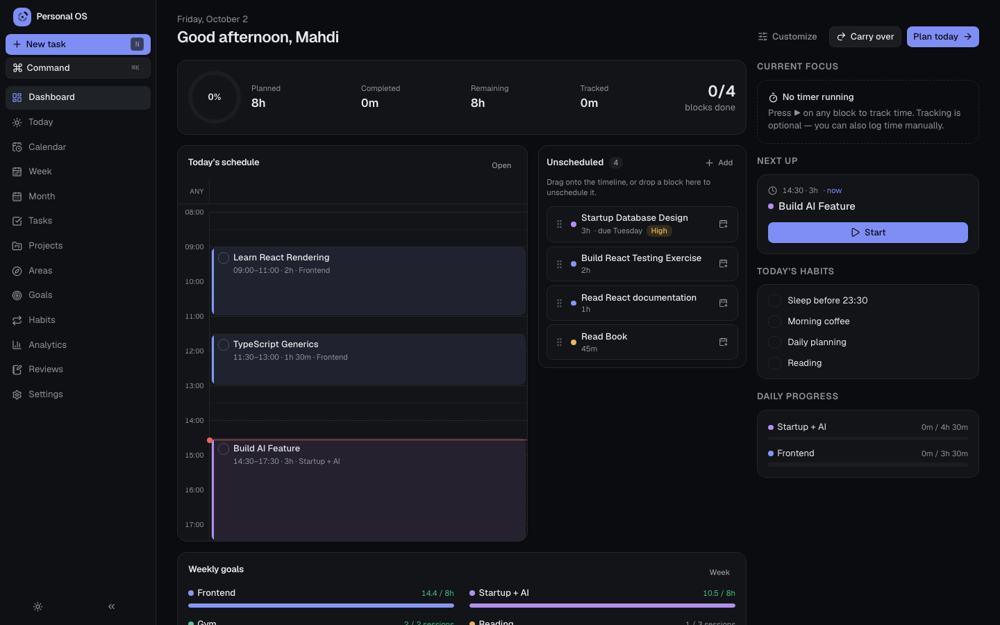<br/><sub><b>خانه</b>: اعداد امروز، تایم‌لاین، بعدی‌ها و عادت‌ها</sub></p>

<table>
  <tr>
    <td width="50%">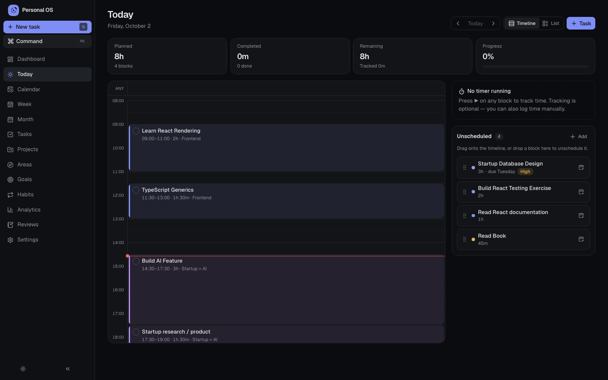<br/><sub><b>امروز</b>: تایم‌لاین و کارهای زمان‌بندی‌نشده</sub></td>
    <td width="50%">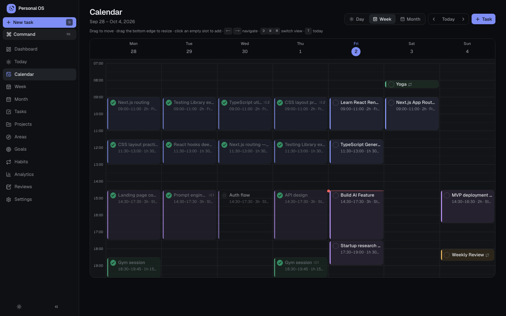<br/><sub><b>تقویم</b>: بکشید، رها کنید و تغییر اندازه بدهید</sub></td>
  </tr>
  <tr>
    <td>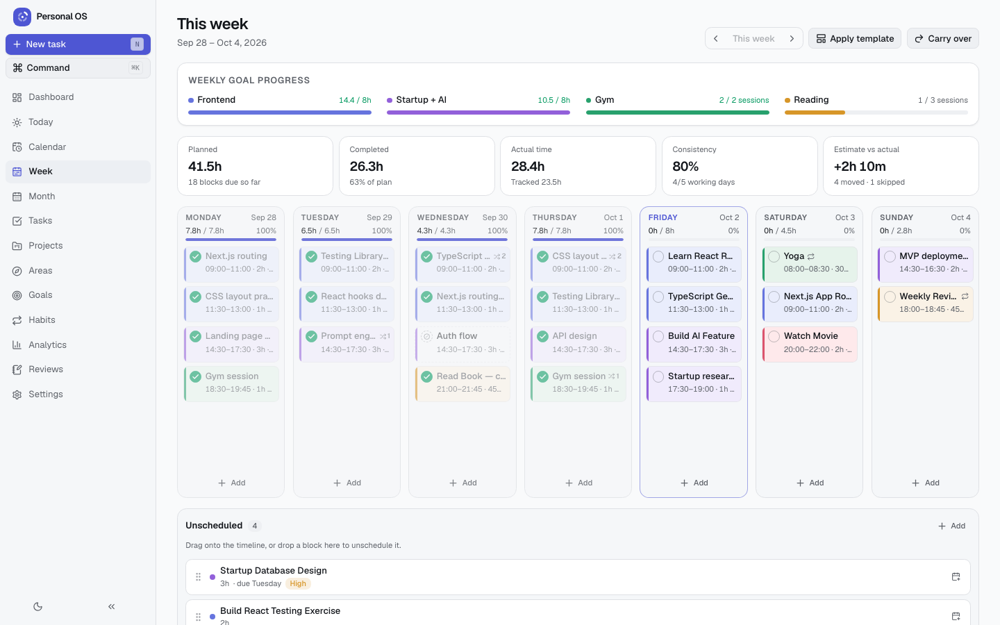<br/><sub><b>برنامه هفته</b> (تم روشن): اهداف، ستون‌های روزها، قالب‌ها</sub></td>
    <td>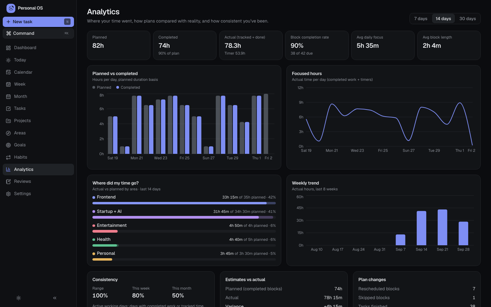<br/><sub><b>تحلیل‌ها</b>: وقت واقعاً کجا رفت</sub></td>
  </tr>
  <tr>
    <td>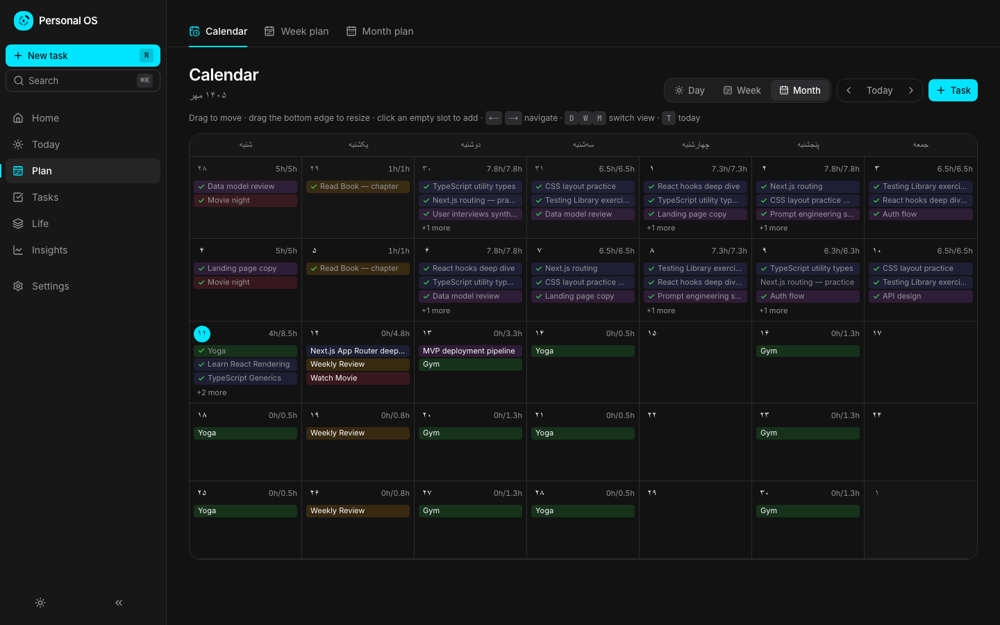<br/><sub><b>تقویم شمسی</b>: نام‌ها و اعداد فارسی، شروع هفته از شنبه</sub></td>
    <td>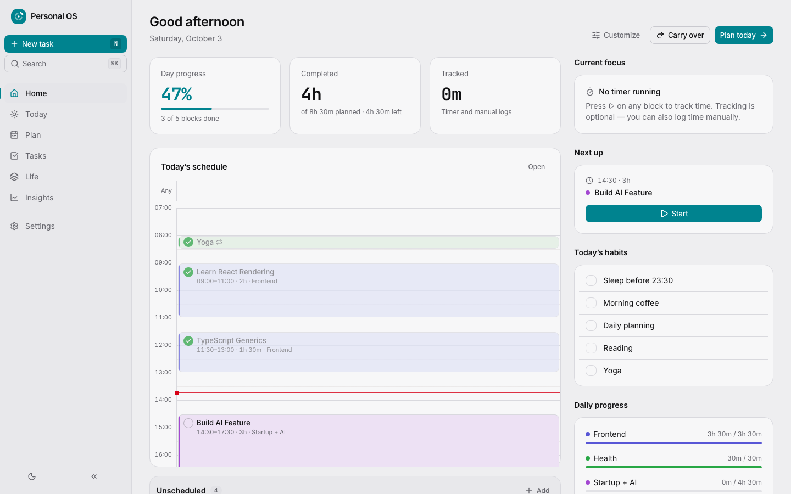<br/><sub><b>خانه</b> (تم روشن)</sub></td>
  </tr>
</table>

<p align="center">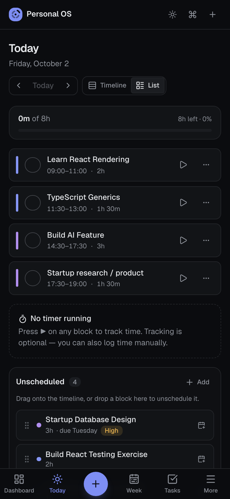<br/><sub><b>موبایل</b>: تکمیل، تایمر و زمان‌بندی مجدد از موبایل</sub></p>

سیستم بصری (رنگ‌ها، تایپ، فاصله‌گذاری و قوانینی که جلوی قالبی به نظر رسیدن را می‌گیرد) در [DESIGN.md](DESIGN.md) مستند شده است.

## 🚀 شروع سریع

به **Node.js 22.22+ یا 24.15+** نیاز دارد.

```bash
git clone https://github.com/Mapl6/personal-os.git
cd personal-os
npm install
npm run dev
```

<http://localhost:3000> را باز کنید. یک راه‌اندازی کوتاه نام، تقویم (میلادی یا شمسی)، روزهای و ساعات کاری، حوزه‌های زندگی و اهداف هفتگی‌تان را می‌پرسد و سپس یک قالب پیش‌فرض **Normal Week** می‌سازد. برای کاوش با داده‌های نمونه (پروژه‌ها، کارها، عادت‌ها و سه هفته تاریخچه) **Include example data** را روشن کنید، یا با **Try the demo** (یا باز کردن [`/?demo=1`](https://personal-os-nine-lime.vercel.app/?demo=1)) راه‌اندازی را کامل رد کنید. نسخه نمایشی فقط در مرورگری اجرا می‌شود که راه‌اندازی نشده، پس هرگز به داده‌های موجود دست نمی‌زند.

| اسکریپت | کار |
|---|---|
| `npm run dev` | سرور توسعه |
| `npm run build` / `npm start` | بیلد پروداکشن / اجرا |
| `npm run typecheck` | بررسی strict تایپ‌اسکریپت |
| `npm run lint` | ESLint (قوانین Next.js + React Compiler) |
| `npm test` | تست‌های واحد و کامپوننت Vitest + React Testing Library |
| `npm run test:e2e` | سناریوهای end-to-end با Playwright (دسکتاپ و موبایل) |

### استقرار

یک اپ استاندارد Next.js است، پس بدون هیچ پیکربندی اضافه روی Vercel (یا هر هاست Node) مستقر می‌شود. دیتابیس سرور ندارد: هر مرورگر داده‌های خودش را نگه می‌دارد.

## 🇮🇷 تقویم شمسی / فارسی

از مسیر **Settings ← Calendar & language** عوض کنید، یا موقع راه‌اندازی انتخابش کنید:

- مرزهای ماه **هجری شمسی (شمسی / جلالی)** همه‌جا اعمال می‌شود: نماهای ماهانه، اهداف ماهانه، تحلیل‌ها، مرورها و کارهای تکرارشونده ماهانه.
- یک **انتخاب‌گر تاریخ شمسی** جایگزین انتخاب‌گر میلادی مرورگر می‌شود.
- نام ماه‌ها و روزها به **فارسی یا انگلیسی** (مثلاً «مهر» یا *Mehr*)، **اعداد فارسی** (۱۲۳) و ساعت ۱۲ یا ۲۴ ساعته.
- **Use Iranian defaults** با یک کلیک شمسی، نام‌ها و اعداد فارسی، شروع هفته از شنبه و هفته کاری شنبه تا پنجشنبه را فعال می‌کند.
- **Quick Add فارسی می‌فهمد**: `ورزش ۲ ساعت فردا ۱۸:۰۰`، `کتاب شنبه`، `امروز`، `پس‌فردا`.
- تبدیل با تقویم فارسی داخلی مرورگر (`Intl`) انجام می‌شود، پس وابستگی اضافه‌ای نیست. تاریخ‌ها همیشه به شکل میلادی ذخیره می‌شوند، پس با عوض کردن تقویم چیزی از دست نمی‌رود.

> **فارسی:** این برنامه از تقویم شمسی پشتیبانی می‌کند: نام ماه‌ها و روزها به فارسی، اعداد فارسی، شروع هفته از شنبه و انتخاب تاریخ شمسی. از مسیر «Settings → Calendar & language» فعالش کنید.

## 🔒 داده‌های شما

- همه‌چیز **در مرورگر شما (IndexedDB)** ذخیره می‌شود. هیچ اکانت، رهگیری و سروری در کار نیست.
- از *Settings ← Data* یک بکاپ کامل JSON **اکسپورت و ایمپورت** کنید یا همه‌چیز را ریست کنید.
- ذخیره‌سازی پشت یک اینترفیس repository است، پس بعداً می‌توان بدون دست زدن به UI یک بک‌اند PostgreSQL / API اضافه کرد.

## 🏗️ معماری

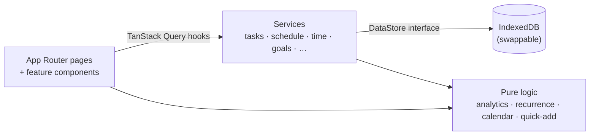

- **کار در برابر بلاک.** *کار* (task) خودِ کار است و *بلاک زمان‌بندی* (schedule block) زمانِ برنامه‌ریزی‌شده آن. یک کار می‌تواند چند بلاک داشته باشد، پس جابه‌جایی، تقسیم و تکرار هرگز کار را تکراری نمی‌کند. جابه‌جایی‌ها برای بینش شمرده می‌شوند ولی هرگز به‌عنوان شکست نمایش داده نمی‌شوند.
- **یک منبع حقیقت برای زمان.** بلاک‌های تکمیل‌شده و ورودی‌های تایمر در یک جا ترکیب می‌شوند، پس اهداف و تحلیل‌ها هرگز یک زمان را دو بار نمی‌شمارند.
- **پیشنهاد ← تأیید ← اعمال.** تغییرهای انبوه (انتقال کارها، اعمال قالب‌ها) به‌صورت فهرستی از تغییرهای پیشنهادی ساخته می‌شوند که اول بازبینی‌شان می‌کنید. یک دستیار برنامه‌ریزی هوش مصنوعی در آینده به همین جریان وصل می‌شود.
- **کانتکست غول‌پیکر ممنوع.** داده‌ها در TanStack Query زندگی می‌کنند (آپدیت خوش‌بینانه برای درگ‌انددراپ)، وضعیت UI در یک استور سلکتوری کوچک و کل منطق کسب‌وکار در توابع خالص و تست‌شده.

```
src/
  app/            Next.js App Router (thin pages): (app)/ is the planner behind onboarding, (public)/roadmap is public
  features/       dashboard · today · calendar · week · month · tasks · goals · …
  components/     ui (shadcn/ui on Radix) · layout · shared
  services/       use-cases over the DataStore
  repositories/   IndexedDB + in-memory implementations
  lib/            date & calendar · analytics · recurrence · scheduling · quick-add
  types/          Zod schemas for every entity
e2e/              Playwright flows
```

**استک:** Next.js 16 · React 19 · TypeScript · Tailwind CSS 4 · shadcn/ui (Radix) · dnd-kit · TanStack Query · Zod · React Hook Form · date-fns · Recharts · Lucide · Vitest · Testing Library · Playwright.

## 🧪 تست‌ها

- **تست‌های واحد و کامپوننت (Vitest + React Testing Library):** زمان‌بندی، تقسیم و ادغام، هدف‌های زمان‌بندی مجدد، تکرار، رهگیری زمان، پیشرفت اهداف، تحلیل‌ها، پارسر Quick Add، تقویم جلالی و ماندگاری IndexedDB.
- **تست‌های end-to-end (Playwright):** آنبوردینگ، quick add، ساخت/تکمیل با ماندگاری، کشیدن روی تایم‌لاین، کشیدن بین روزها، تغییر اندازه، تایمر، زمان‌بندی مجدد، قالب‌ها، پیشرفت اهداف، تقویم شمسی، تم، شخصی‌سازی و چیدمان موبایل.

## 🗺️ نقشه راه

- [x] **MVP:** داشبورد، today، week، month، تقویم، کارها، پروژه‌ها، درگ‌انددراپ، رهگیری زمان، اهداف، تحلیل‌ها، ماندگاری لوکال
- [x] عادت‌ها، مرورها، اعلان‌ها، کارهای تکرارشونده
- [x] تقویم شمسی، تم روشن، شخصی‌سازی
- [ ] PWA نصب‌شدنی با اعلان‌های پس‌زمینه
- [ ] بک‌اند اختیاری: اکانت‌ها، PostgreSQL و همگام‌سازی بین دستگاه‌ها
- [ ] دستیار برنامه‌ریزی هوش مصنوعی: «هفته‌ام را برنامه‌ریزی کن»، «امروز فقط ۴ ساعت وقت دارم»، همیشه پیشنهاد ← تأیید ← اعمال

برنامه بلندمدت برای تبدیل این اپ به یک **second brain و life OS** کامل (صفحات و یادداشت‌ها، دیتابیس‌ها، ماژول‌های زندگی، ثبت همه‌جا، همگام‌سازی و هوش مصنوعی) در [docs/ROADMAP.md](docs/ROADMAP.md) است، با [کاتالوگ کامل ویژگی‌ها](docs/features/README.md)، [اسناد طراحی فنی](docs/technical/README.md) و [تحلیل رقبا](docs/research/competitive-analysis.md). اپ همچنین یک نسخه عمومی و تعاملی در **`/roadmap`** ارائه می‌دهد: هر ویژگی بر اساس فاز، با مقایسه اپ امروز با هر فاز تا تکمیل. این صفحه در زمان بیلد از `docs/features/` ساخته می‌شود و به آنبوردینگ نیازی ندارد.

## 🤝 مشارکت

ایشوها و پول‌ریکوئست‌ها خوش‌آمدند. از [CONTRIBUTING.md](CONTRIBUTING.md) شروع کنید، یک ایشوی با لیبل [good first issue](https://github.com/Mapl6/personal-os/labels/good%20first%20issue) بردارید، یا در [Discussions](https://github.com/Mapl6/personal-os/discussions) بپرسید. قبل از باز کردن PR اجرا کنید:

```bash
npm run typecheck && npm run lint && npm test && npm run test:e2e
```

## ⭐ حمایت

اگر Personal OS برایتان مفید است، یک ستاره در گیت‌هاب کمک می‌کند دیگران هم پیدایش کنند.

## 📄 لایسنس

[MIT](LICENSE) © 2026 Mahdi
