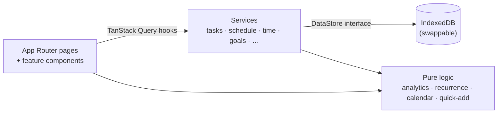

<div align="center">


🌐 [English](README.md)

**یک سیستم‌عامل آرام و لوکال‌فرست برای برنامه‌ریزی، اجرا و مرور روزها، هفته‌ها و ماه‌ها.**

برنامه‌ریزی ← اجرا ← ثبت ← مرور ← اصلاح. برنامه‌ها فرضیه‌اند: جابه‌جا کردن یک کار طبیعی است، نه شکست.

[](https://nextjs.org)
[](https://react.dev)
[](https://www.typescriptlang.org)
[](https://tailwindcss.com)
[](#-دادههای-شما)
[](#-تقویم-شمسی--فارسی)
[](#-تستها)
[](LICENSE)
[](https://github.com/Mapl6/personal-os/stargazers)

**[▶ نسخهٔ نمایشی زنده را امتحان کنید](https://personal-os-nine-lime.vercel.app/?demo=1)** · [باز کردن اپ](https://personal-os-nine-lime.vercel.app) · [نقشهٔ راه عمومی](https://personal-os-nine-lime.vercel.app/roadmap)

[ویژگی‌ها](#-ویژگیها) · [اسکرین‌شات‌ها](#-اسکرینشاتها) · [شروع سریع](#-شروع-سریع) · [تقویم شمسی](#-تقویم-شمسی--فارسی) · [معماری](#️-معماری) · [نقشهٔ راه](#️-نقشهٔ-راه)


</div>

---

## چرا

بیشتر اپ‌های بهره‌وری یا یک تقویم خشک‌اند یا یک لیست بی‌پایان کارها، و هر دو وقتی زندگی برنامه را به‌هم می‌زند، بی‌سروصدا تنبیه‌تان می‌کنند. **Personal OS** با برنامه مثل چیزی رفتار می‌کند که باید اصلاحش کرد. این اپ برای یک روتین تمام‌وقتِ خودسازی ساخته شده (یادگیری، پروژه‌های جانبی، استارتاپ، سلامت، کتاب، استراحت) و به شما کمک می‌کند به این سؤال‌ها پاسخ بدهید:

- امروز دقیقاً چه کارهایی باید بکنم و بعد از آن چه چیزی در راه است؟
- واقعاً چقدر وقت گذاشتم و کجا رفت؟
- آیا بین یادگیری، کار، سلامت و زندگی تعادل را حفظ می‌کنم؟
- هفتهٔ آینده چه چیزی را باید تغییر بدهم؟

برای **ثبات، شفافیت، انعطاف‌پذیری، برنامه‌ریزی واقع‌بینانه و پیشرفت بلندمدت** بهینه شده، نه برای بیشینه کردن تیک‌ها.

## ✨ ویژگی‌ها

| | |
|---|---|
| 🗓️ **زمان‌بندی منعطف** | کارها را روی تایم‌لاین بکشید و رها کنید، بلاک‌ها را به زمان‌ها یا روزهای دیگر ببرید، با کشیدن لبه اندازه‌شان را عوض کنید، یک کار ۲ ساعته را به ۱ ساعت امروز و ۱ ساعت فردا تقسیم کنید و تکه‌ها را دوباره ادغام کنید. خودِ کار هرگز تکرار نمی‌شود. |
| ☀️ **امروز** | تایم‌لاین در دسکتاپ، فهرستی با دکمه‌های لمسی بزرگ در موبایل، و استخر کارهای زمان‌بندی‌نشده در کنار. هر بلاک را از همان‌جا کامل کنید، تایمر بگیرید، رد کنید، جابه‌جا کنید، ویرایش یا حذف کنید. |
| 📅 **تقویم** | نمای روزانه، هفتگی و ماهانه با درگ و دراپ، ساخت با کلیک، تغییر اندازه و میان‌برهای صفحه‌کلید (`←/→`، `D/W/M`، `T`). |
| 📊 **هفته و ماه** | ساعت‌های برنامه‌ریزی‌شده در برابر انجام‌شده برای هر روز، پیشرفت اهداف هفتگی، **قالب‌های هفته** قابل‌استفادهٔ مجدد (پیشنهاد ← بازبینی ← اعمال)، اهداف ماهانه، نقاط عطف و خلاصه‌های هفتگی. |
| 🎯 **اهداف** | اهداف روزانه، هفتگی، ماهانه و بلندمدت بر اساس ساعت، جلسه، کار، صفحه یا واحد دلخواه. پیشرفت به‌صورت خودکار از کارهای انجام‌شده ثبت می‌شود یا دستی وارد می‌شود. اهداف بلندمدت به نقاط عطف و کارها شکسته می‌شوند. |
| ⏱️ **ثبت زمان** | تایمر اختیاری شروع / مکث / ادامه / توقف، ثبت دستی و تاریخچهٔ قابل‌ویرایش. برنامه‌ریزی و ثبت زمان از هم جدا می‌مانند. |
| 🔁 **کارهای تکرارشونده** | روزانه، هفتگی (روزهای دلخواه) یا ماهانه. هر تکرار را می‌شود جداگانه جابه‌جا یا رد کرد و چیزی به گذشته اضافه نمی‌شود. |
| 📈 **تحلیل‌ها** | برنامه‌ریزی‌شده در برابر انجام‌شده، ساعت‌های متمرکز، «وقتم کجا رفت؟»، روند هفتگی، ثبات، اختلاف تخمین و واقعیت، و کارهایی که زیاد جابه‌جا می‌شوند. |
| 📝 **مرورها و عادت‌ها** | مرورهای روزانه، هفتگی و ماهانه (با نمایش داده‌ها کنار پاسخ‌هایتان و سؤالات قابل‌ویرایش) به‌علاوهٔ یک ردیاب سادهٔ عادت با زنجیره. |
| ⌘ **مرکز فرمان** | `⌘/Ctrl + K`: جست‌وجو، ناوبری، شروع تایمرها، جابه‌جایی و **Quick Add** به زبان ساده، مثلاً `React 2h tomorrow`، `Gym Thursday 18:00`، `Startup 3h Saturday #mvp !high`، `Weekly Review every sunday 18:00`. |
| 🌙 **روشن و تاریک** | پیش‌فرض تاریک، با کلید یک‌کلیکهٔ روشن/تاریک، هفت رنگ تأکیدی (پیش‌فرض فیروزه‌ای) و دو سطح تراکم. |
| 🧭 **فضاها، نه صفحه‌های پراکنده** | شش فضا در نوار کناری (خانه، امروز، برنامه، کارها، زندگی، بینش). صفحات مرتبط به‌صورت تب داخل یک فضا زندگی می‌کنند (فضای «برنامه» تقویم، برنامهٔ هفته و برنامهٔ ماه را دارد؛ فضای «زندگی» اهداف، پروژه‌ها، حوزه‌ها و عادت‌ها را دارد)، درحالی‌که هر صفحه آدرس و میان‌بر `g` خودش را دارد. |
| 🧩 **شخصی‌سازی** | ویجت‌های داشبورد، فضاهای نوار کناری، پیش‌فرض‌های کارها، نام اولویت‌ها، زوم تایم‌لاین، سؤالات مرور، ترتیب حوزه‌ها و عادت‌ها، و مدیر برچسب‌ها (تغییر نام، ادغام یا حذف برچسب‌ها). |
| 📱 **واکنش‌گرا** | نوار کناری در دسکتاپ، ریل جمع‌شونده در تبلت، ناوبری پایین در موبایل. |
| ♿ **دسترس‌پذیر** | درگ و دراپ با صفحه‌کلید، حالت‌های فوکوس، برچسب‌های صفحه‌خوان و پشتیبانی از کاهش حرکت. |

## 📸 اسکرین‌شات‌ها

<p align="center"><br/><sub><b>خانه</b>: اعداد امروز، تایم‌لاین، بعدی‌ها و عادت‌ها</sub></p>

<table>
  <tr>
    <td width="50%"><br/><sub><b>امروز</b>: تایم‌لاین و کارهای زمان‌بندی‌نشده</sub></td>
    <td width="50%"><br/><sub><b>تقویم</b>: بکشید، رها کنید و اندازه را عوض کنید</sub></td>
  </tr>
  <tr>
    <td><br/><sub><b>برنامهٔ هفته</b> (تم روشن): اهداف، ستون‌های روزها، قالب‌ها</sub></td>
    <td><br/><sub><b>تحلیل‌ها</b>: وقت واقعاً کجا رفت</sub></td>
  </tr>
  <tr>
    <td><br/><sub><b>تقویم شمسی</b>: نام‌ها و اعداد فارسی، شروع هفته از شنبه</sub></td>
    <td><br/><sub><b>خانه</b> (تم روشن)</sub></td>
  </tr>
</table>

<p align="center"><br/><sub><b>موبایل</b>: از موبایل کامل کنید، تایمر بگیرید و جابه‌جا کنید</sub></p>

سیستم بصری (رنگ‌ها، تایپ، فاصله‌ها و قواعدی که جلوی قالبی به‌نظر رسیدن ظاهر را می‌گیرد) در [DESIGN.md](DESIGN.md) مستند شده است.

## 🚀 شروع سریع

نیازمند **Node.js 22.22+ یا 24.15+** است.

```bash
git clone https://github.com/Mapl6/personal-os.git
cd personal-os
npm install
npm run dev
```

<http://localhost:3000> را باز کنید. یک راه‌اندازی کوتاه نام، تقویم (میلادی یا شمسی)، روزها و ساعت‌های کاری، حوزه‌های زندگی و اهداف هفتگی شما را می‌پرسد و سپس یک قالب پیش‌فرض **Normal Week** می‌سازد. برای کاوش با داده‌های نمونه (پروژه‌ها، کارها، عادت‌ها و سه هفته تاریخچه) گزینهٔ **Include example data** را فعال کنید، یا با **Try the demo** کل راه‌اندازی را رد کنید (یا [`/?demo=1`](https://personal-os-nine-lime.vercel.app/?demo=1) را باز کنید). نسخهٔ نمایشی فقط در مرورگری اجرا می‌شود که هنوز راه‌اندازی نشده، پس هرگز به داده‌های موجود شما دست نمی‌زند.

| اسکریپت | کار |
|---|---|
| `npm run dev` | سرور توسعه |
| `npm run build` / `npm start` | بیلد پروداکشن / اجرا |
| `npm run typecheck` | بررسی strict تایپ‌اسکریپت |
| `npm run lint` | ESLint (قواعد Next.js و React Compiler) |
| `npm test` | تست‌های واحد و کامپوننت Vitest و React Testing Library |
| `npm run test:e2e` | سناریوهای سرتاسری Playwright (دسکتاپ و موبایل) |

### استقرار

یک اپ استاندارد Next.js است، پس بدون هیچ پیکربندی اضافه روی Vercel (یا هر هاست Node) مستقر می‌شود. دیتابیس سروری ندارد: هر مرورگر داده‌های خودش را نگه می‌دارد.

## 🇮🇷 تقویم شمسی / فارسی

از مسیر **Settings → Calendar & language** عوضش کنید، یا موقع راه‌اندازی انتخابش کنید:

- مرزهای ماه در **هجری شمسی (شمسی / جلالی)** همه‌جا اعمال می‌شود: نمای ماه، اهداف ماهانه، تحلیل‌ها، مرورها و کارهای تکرارشوندهٔ ماهانه.
- یک **انتخاب‌گر تاریخ شمسی** جایگزین انتخاب‌گر میلادی مرورگر می‌شود.
- نام ماه‌ها و روزها به **فارسی یا انگلیسی** (مثلاً «مهر» یا *Mehr*)، **اعداد فارسی** (۱۲۳) و ساعت ۱۲ یا ۲۴ ساعته.
- **Use Iranian defaults** با یک کلیک شمسی، نام‌ها و اعداد فارسی، شروع هفته از شنبه و هفتهٔ کاری شنبه تا پنجشنبه را فعال می‌کند.
- **Quick Add فارسی می‌فهمد**: `ورزش ۲ ساعت فردا ۱۸:۰۰`، `کتاب شنبه`، `امروز`، `پس‌فردا`.
- تبدیل تاریخ از تقویم فارسی داخلی `Intl` مرورگر استفاده می‌کند، پس وابستگی اضافه‌ای ندارد. تاریخ‌ها همیشه به شکل میلادی ذخیره می‌شوند، پس با عوض کردن تقویم چیزی از دست نمی‌رود.

## 🔒 داده‌های شما

- همه‌چیز **در مرورگر شما (IndexedDB)** ذخیره می‌شود. نه اکانتی هست، نه ردیابی و نه سروری.
- از مسیر *Settings → Data* یک **بکاپ کامل JSON بگیرید و برگردانید**، یا همه‌چیز را ریست کنید.
- ذخیره‌سازی پشت یک اینترفیس repository قرار دارد، پس بعداً می‌شود بدون دست زدن به رابط کاربری، یک بک‌اند PostgreSQL / API اضافه کرد.

## 🏗️ معماری



- **کار در برابر بلاک.** یک *task* خودِ کار است و یک *schedule block* زمانِ برنامه‌ریزی‌شدهٔ آن. یک کار می‌تواند چند بلاک داشته باشد، پس جابه‌جا کردن، تقسیم کردن و تکرار هرگز کار را تکراری نمی‌کند. جابه‌جایی‌ها برای بینش شمرده می‌شوند، ولی هرگز به‌عنوان شکست نشان داده نمی‌شوند.
- **یک منبع واحد برای زمان.** بلاک‌های انجام‌شده و رکوردهای تایمر در یک جا ترکیب می‌شوند، پس اهداف و تحلیل‌ها هرگز یک بازهٔ زمانی را دو بار حساب نمی‌کنند.
- **پیشنهاد ← تأیید ← اعمال.** تغییرات انبوه (انتقال کارها، اعمال قالب‌ها) به‌صورت فهرستی از تغییرات پیشنهادی ساخته می‌شود که اول شما بازبینی‌شان می‌کنید. یک دستیار برنامه‌ریزی هوش مصنوعی در آینده به همین جریان وصل خواهد شد.
- **کانتکست غول‌پیکر نداریم.** داده‌ها در TanStack Query زندگی می‌کنند (به‌روزرسانی خوش‌بینانه برای درگ و دراپ)، state رابط کاربری در یک selector store کوچک است و تمام منطق کسب‌وکار در توابع خالص و تست‌شده قرار دارد.

```
src/
  app/            Next.js App Router (thin pages): (app)/ is the planner behind onboarding, (public)/roadmap is public
  features/       dashboard · today · calendar · week · month · tasks · goals · …
  components/     ui (shadcn/ui on Radix) · layout · shared
  services/       use-cases over the DataStore
  repositories/   IndexedDB + in-memory implementations
  lib/            date & calendar · analytics · recurrence · scheduling · quick-add
  types/          Zod schemas for every entity
e2e/              Playwright flows
```

**استک:** Next.js 16 · React 19 · TypeScript · Tailwind CSS 4 · shadcn/ui (Radix) · dnd-kit · TanStack Query · Zod · React Hook Form · date-fns · Recharts · Lucide · Vitest · Testing Library · Playwright.

## 🧪 تست‌ها

- **تست‌های واحد و کامپوننت (Vitest + React Testing Library):** زمان‌بندی، تقسیم و ادغام، مقصدهای زمان‌بندی مجدد، تکرار، ثبت زمان، پیشرفت اهداف، تحلیل‌ها، پارسر Quick Add، تقویم جلالی و پایداری IndexedDB.
- **تست‌های سرتاسری (Playwright):** آنبوردینگ، Quick Add، ساخت/کامل کردن با ماندگاری داده، کشیدن روی تایم‌لاین، کشیدن بین روزها، تغییر اندازه، تایمر، جابه‌جایی، قالب‌ها، پیشرفت اهداف، تقویم شمسی، تم، شخصی‌سازی و چیدمان موبایل.

## 🗺️ نقشهٔ راه

- [x] **MVP:** داشبورد، امروز، هفته، ماه، تقویم، کارها، پروژه‌ها، درگ و دراپ، ثبت زمان، اهداف، تحلیل‌ها، ذخیره‌سازی محلی
- [x] عادت‌ها، مرورها، اعلان‌ها، کارهای تکرارشونده
- [x] تقویم شمسی، تم روشن، شخصی‌سازی
- [ ] PWA نصب‌شدنی با اعلان‌های پس‌زمینه
- [ ] بک‌اند اختیاری: اکانت‌ها، PostgreSQL و همگام‌سازی بین دستگاه‌ها
- [ ] دستیار برنامه‌ریزی هوش مصنوعی: «هفته‌ام را برنامه‌ریزی کن»، «امروز فقط ۴ ساعت وقت دارم» — همیشه پیشنهاد ← تأیید ← اعمال

برنامهٔ بلندمدت برای تبدیل این اپ به یک **second brain و life OS** کامل (صفحات و یادداشت‌ها، دیتابیس‌ها، ماژول‌های زندگی، ثبت همه‌جا، همگام‌سازی و هوش مصنوعی) در [docs/ROADMAP.md](docs/ROADMAP.md) آمده، همراه با [کاتالوگ کامل ویژگی‌ها](docs/features/README.md)، [مستندات طراحی فنی](docs/technical/README.md) و [تحلیل رقابتی](docs/research/competitive-analysis.md). اپ همچنین یک نسخهٔ عمومی و تعاملی در **`/roadmap`** دارد: هر ویژگی بر اساس فاز، با مقایسهٔ اپ امروز با هر فاز تا تکمیل. این صفحه در زمان بیلد از `docs/features/` ساخته می‌شود و نیازی به آنبوردینگ ندارد.

## 🤝 مشارکت

ایشوها و pull requestها خوش‌آمدند. از [CONTRIBUTING.md](CONTRIBUTING.md) شروع کنید، یک issue با برچسب [good first issue](https://github.com/Mapl6/personal-os/labels/good%20first%20issue) بردارید یا در [Discussions](https://github.com/Mapl6/personal-os/discussions) سؤال بپرسید. قبل از باز کردن PR اجرا کنید:

```bash
npm run typecheck && npm run lint && npm test && npm run test:e2e
```

## ⭐ حمایت

اگر Personal OS برایتان مفید است، یک ستاره در گیت‌هاب کمک می‌کند دیگران هم پیدایش کنند.

## 📄 لایسنس

[MIT](LICENSE) © 2026 Mahdi
