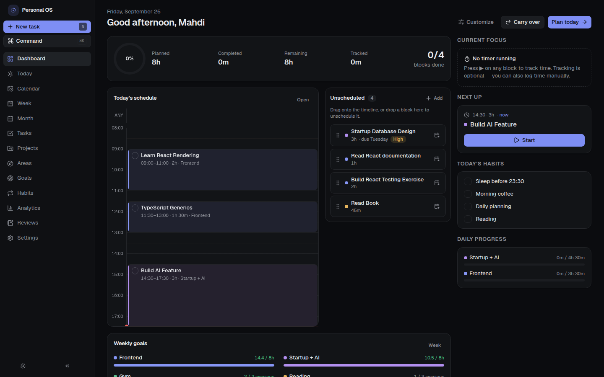
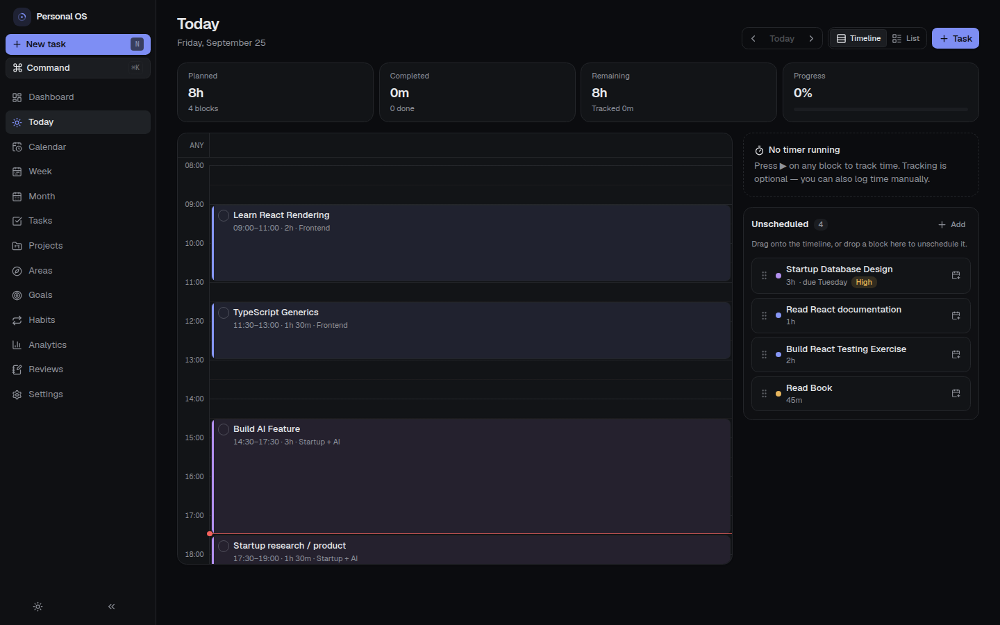
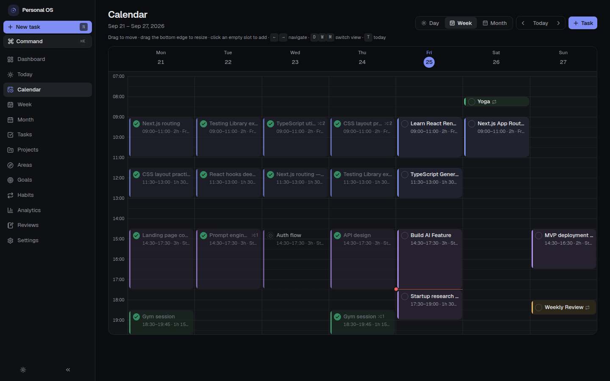
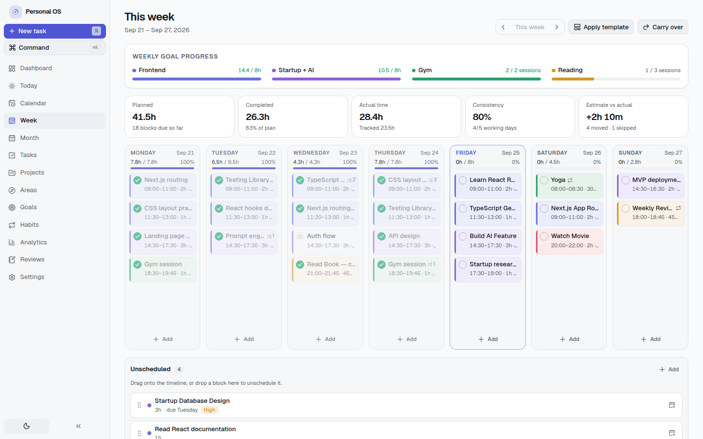
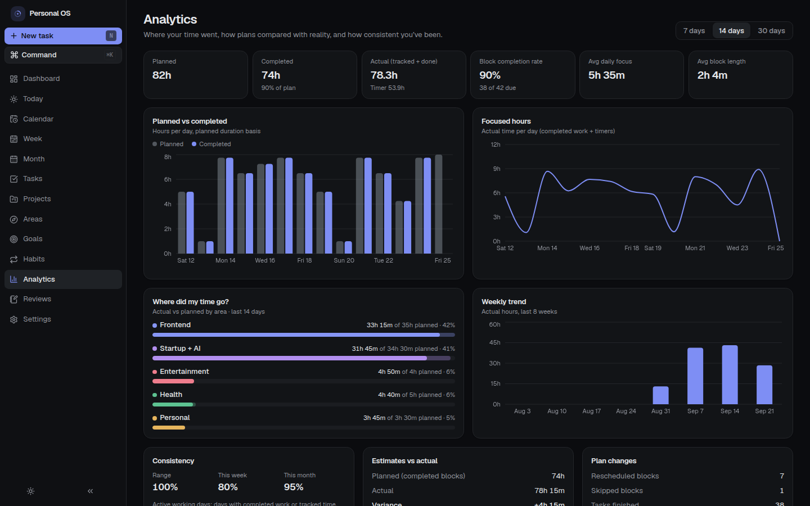
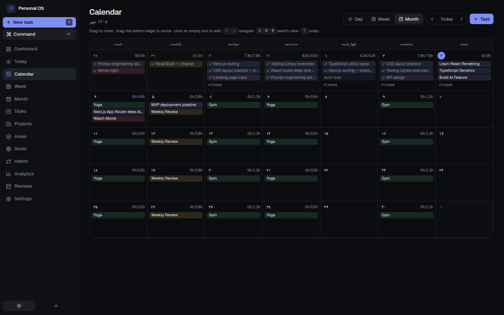
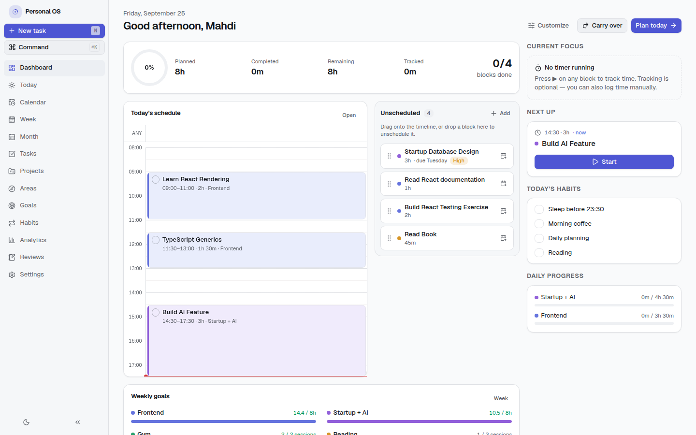
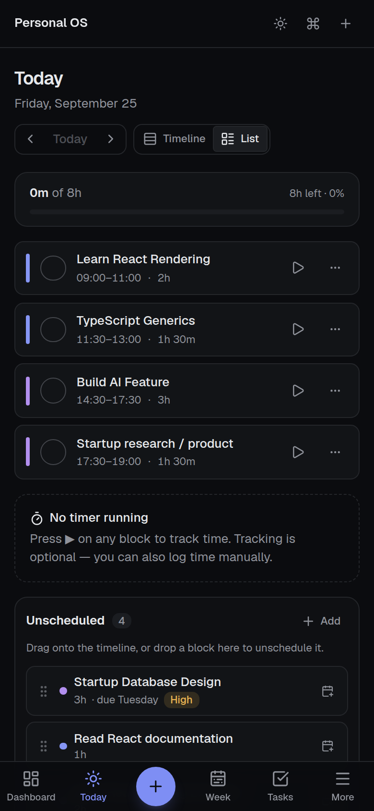
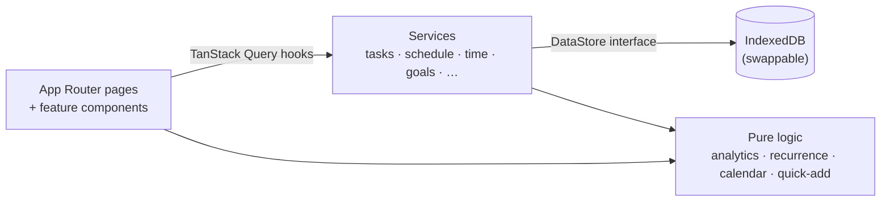

<div align="center">

# Personal OS

**A calm, local-first operating system for planning, doing and reviewing your days, weeks and months.**

Plan → Execute → Track → Review → Adjust. Plans are hypotheses: moving a task is normal, never a failure.

[](https://nextjs.org)
[](https://react.dev)
[](https://www.typescriptlang.org)
[](https://tailwindcss.com)
[](#-your-data)
[](#-shamsi--persian-calendar)
[](#-testing)

[Features](#-features) · [Screenshots](#-screenshots) · [Quick start](#-quick-start) · [Shamsi calendar](#-shamsi--persian-calendar) · [Architecture](#-architecture) · [Roadmap](#-roadmap)



</div>

---

## Why

Most productivity apps are either a rigid calendar or an endless to-do list, and both quietly punish you when life changes the plan. **Personal OS** treats the plan as something you adjust. It's built for a full-time self-development routine (learning, side projects, a startup, health, books, rest), and it helps you answer:

- What am I supposed to do today, and what's next?
- How much time did I actually spend, and where did it go?
- Am I keeping a balance between learning, work, health and life?
- What should I change next week?

It optimises for **consistency, clarity, flexibility, realistic planning and long-term progress**, not for maximising checkmarks.

## ✨ Features

| | |
|---|---|
| 🗓️ **Flexible scheduling** | Drag tasks onto a timeline, drag blocks to other times or days, resize by dragging the edge, split a 2h task into 1h today and 1h tomorrow, merge sessions back. The task itself is never duplicated. |
| ☀️ **Today** | Timeline on desktop, a list with large touch targets on phones, and an unscheduled pool on the side. Complete, start a timer, skip, reschedule, edit or delete right from each block. |
| 📅 **Calendar** | Day, week and month views with drag & drop, click-to-create, resizing and keyboard shortcuts (`←/→`, `D/W/M`, `T`). |
| 📊 **Week & month** | Per-day planned vs completed hours, weekly goal progress, reusable **week templates** (proposal → review → apply), monthly goals, milestones and weekly summaries. |
| 🎯 **Goals** | Daily, weekly, monthly and long-term goals measured in hours, sessions, tasks, pages or custom units. Progress is tracked automatically from completed work, or logged manually. Long-term goals break down into milestones and tasks. |
| ⏱️ **Time tracking** | Optional start / pause / resume / stop timer, manual entries and editable history. Planning and tracking stay separate. |
| 🔁 **Recurring tasks** | Daily, weekly (custom days) or monthly. Each occurrence can be moved or skipped on its own, and nothing is back-filled into the past. |
| 📈 **Analytics** | Planned vs completed, focused hours, "Where did my time go?", weekly trend, consistency, estimate-vs-actual variance and frequently moved tasks. |
| 📝 **Reviews & habits** | Daily, weekly and monthly reviews (with the data shown next to your answers, and editable questions) plus a simple habit tracker with streaks. |
| ⌘ **Command Center** | `⌘/Ctrl + K`: search, navigate, start timers, reschedule, and **Quick Add** in plain language, e.g. `React 2h tomorrow`, `Gym Thursday 18:00`, `Startup 3h Saturday #mvp !high`, `Weekly Review every sunday 18:00`. |
| 🌙 **Light & dark** | Dark by default, with a one-click light/dark toggle, six accent colours and two density levels. |
| 🧩 **Customisable** | Dashboard widgets, sidebar items, task defaults, priority names, timeline zoom, review questions, area and habit order, and a tag manager (rename, merge or delete tags). |
| 📱 **Responsive** | Sidebar on desktop, collapsible rail on tablet, bottom navigation on phones. |
| ♿ **Accessible** | Keyboard drag & drop, focus states, screen-reader labels and support for reduced motion. |

## 📸 Screenshots

<table>
  <tr>
    <td width="50%"><br/><sub><b>Today</b>: timeline and unscheduled tasks</sub></td>
    <td width="50%"><br/><sub><b>Calendar</b>: drag, drop and resize</sub></td>
  </tr>
  <tr>
    <td><br/><sub><b>Week</b> (light theme): goals, day columns, templates</sub></td>
    <td><br/><sub><b>Analytics</b>: where the time actually went</sub></td>
  </tr>
  <tr>
    <td><br/><sub><b>Shamsi calendar</b>: Persian names and digits, week starts Saturday</sub></td>
    <td><br/><sub><b>Dashboard</b> (light theme)</sub></td>
  </tr>
</table>

<p align="center"><br/><sub><b>Mobile</b>: complete, time and reschedule from your phone</sub></p>

## 🚀 Quick start

Requires **Node.js 22.22+ or 24.15+**.

```bash
git clone https://github.com/Mapl6/personal-os.git
cd personal-os
npm install
npm run dev
```

Open <http://localhost:3000>. A short setup asks for your name, calendar (Gregorian or Shamsi), working days and hours, life areas and weekly goals, then creates a default **Normal Week** template. Turn on **Include example data** to explore with sample projects, tasks, habits and three weeks of history.

| Script | What it does |
|---|---|
| `npm run dev` | Development server |
| `npm run build` / `npm start` | Production build / serve |
| `npm run typecheck` | Strict TypeScript check |
| `npm run lint` | ESLint (Next.js + React Compiler rules) |
| `npm test` | Vitest unit and React Testing Library component tests |
| `npm run test:e2e` | Playwright end-to-end flows (desktop and mobile) |

### Deploy

It's a standard Next.js app, so it deploys to Vercel (or any Node host) with no extra configuration. There's no server database: each browser keeps its own data.

## 🇮🇷 Shamsi / Persian calendar

Switch under **Settings → Calendar & language**, or pick it during setup:

- **Solar Hijri (Shamsi / Jalali)** month boundaries apply everywhere: month views, monthly goals, analytics, reviews and monthly recurring tasks.
- A **Shamsi date picker** replaces the browser's Gregorian one.
- Month and day names in **Persian or English** (e.g. «مهر» or *Mehr*), **Persian digits** (۱۲۳), and 12h or 24h time.
- **Use Iranian defaults** sets Shamsi, Persian names and digits, a Saturday week start and a Saturday–Thursday working week in one click.
- **Quick Add understands Persian**: `ورزش ۲ ساعت فردا ۱۸:۰۰`, `کتاب شنبه`, `امروز`, `پس‌فردا`.
- Conversion uses the browser's built-in `Intl` Persian calendar, so there's no extra dependency. Dates are always stored in Gregorian form, so switching calendars loses nothing.

> **فارسی:** این برنامه از تقویم شمسی پشتیبانی می‌کند: نام ماه‌ها و روزها به فارسی، اعداد فارسی، شروع هفته از شنبه و انتخاب تاریخ شمسی. از مسیر «Settings → Calendar & language» فعالش کنید.

## 🔒 Your data

- Everything is stored **in your browser (IndexedDB)**. There are no accounts, no tracking and no server.
- **Export and import** a complete JSON backup, or reset everything, from *Settings → Data*.
- Storage sits behind a repository interface, so a PostgreSQL / API backend can be added later without touching the UI.

## 🏗️ Architecture



- **Task vs. block.** A *task* is the work and a *schedule block* is when it's planned. One task can have many blocks, so moving, splitting and recurring never duplicate work. Moves are counted for insight but never shown as failures.
- **One source of truth for time.** Completed blocks and timer entries are combined in one place, so goals and analytics never count the same time twice.
- **Propose → confirm → apply.** Bulk changes (carrying work over, applying templates) are built as a list of proposed changes that you review first. A future AI planning assistant will plug into the same flow.
- **No giant context.** Data lives in TanStack Query (optimistic updates for drag & drop), UI state lives in a tiny selector store, and all business logic lives in pure, tested functions.

```
src/
  app/            Next.js App Router (thin pages)
  features/       dashboard · today · calendar · week · month · tasks · goals · …
  components/     ui (shadcn/ui on Radix) · layout · shared
  services/       use-cases over the DataStore
  repositories/   IndexedDB + in-memory implementations
  lib/            date & calendar · analytics · recurrence · scheduling · quick-add
  types/          Zod schemas for every entity
e2e/              Playwright flows
```

**Stack:** Next.js 16 · React 19 · TypeScript · Tailwind CSS 4 · shadcn/ui (Radix) · dnd-kit · TanStack Query · Zod · React Hook Form · date-fns · Recharts · Lucide · Vitest · Testing Library · Playwright.

## 🧪 Testing

- **Unit and component tests (Vitest + React Testing Library):** scheduling, splitting and merging, rescheduling targets, recurrence, time tracking, goal progress, analytics, the Quick Add parser, the Jalali calendar and IndexedDB persistence.
- **End-to-end tests (Playwright):** onboarding, quick add, create/complete with persistence, dragging onto the timeline, dragging between days, resizing, the timer, rescheduling, templates, goal progress, the Shamsi calendar, theme, customisation and the mobile layout.

## 🗺️ Roadmap

- [x] **MVP:** dashboard, today, week, month, calendar, tasks, projects, drag & drop, time tracking, goals, analytics, local persistence
- [x] Habits, reviews, notifications, recurring tasks
- [x] Shamsi calendar, light theme, customisation
- [ ] Installable PWA with background notifications
- [ ] Optional backend: accounts, PostgreSQL and sync across devices
- [ ] AI planning assistant: "Plan my week", "I only have 4 hours today", always propose → confirm → apply

## 🤝 Contributing

Issues and pull requests are welcome. Before opening a PR, run:

```bash
npm run typecheck && npm run lint && npm test && npm run test:e2e
```
