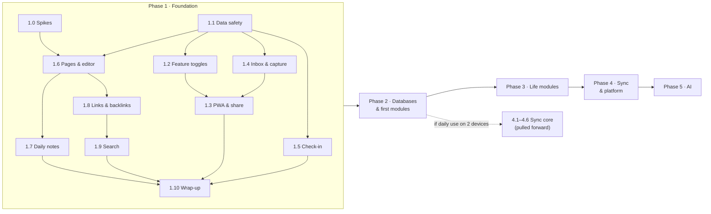
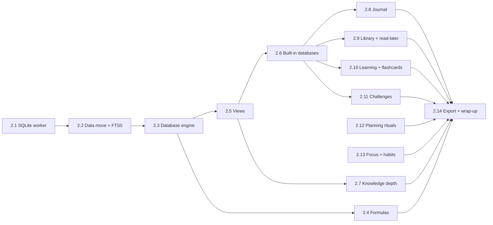

# Development plan

_As of 2026-10-02 · Mahdi_

How to build the [roadmap](ROADMAP.md) step by step. Each phase is split into **milestones** in dependency order; each milestone ends with something you can use or demo. Phase 1 is broken down into **PR-sized tasks**; later phases are planned at milestone level and get the same task breakdown when they start, since what we learn in each phase will change the next.

Feature IDs point into the [feature catalogue](features/README.md); "how" lives in the [technical docs](technical/README.md).

## How to read this

**Sizes** are rough, for one developer: **S** ≈ up to 1 day · **M** ≈ 2–4 days · **L** ≈ 1–2 weeks. They are for ordering and spotting big items, not deadlines.

**Every task** follows the [adding a feature](technical/README.md#adding-a-feature) checklist: schema → migration → repository → pure logic → service → hooks → registry → UI → links/search → export → tests → docs. A task is one PR unless noted.

**Every milestone** ends with: tests green (`npm run typecheck && npm run lint && npm test && npm run test:e2e`), catalogue statuses updated, and its check passed.

## Overview

---

## Phase 1 · Foundation

**Goal:** the app is safe to grow, captures anything, and holds notes linked to the plan. **Exit check:** the Phase 1 "done when" in the [roadmap](ROADMAP.md#phase-1--foundation).

Recommended order: 1.0 and 1.1 first (in parallel), then 1.2. After that, 1.4/1.5 and 1.6 can run in parallel; 1.3 needs 1.4's inbox for the share target; 1.7, 1.8 and 1.9 follow the editor.

### Milestone 1.0 · Spikes

Answer the risky questions before building on them. Spike code is thrown away; the result is a decision written into the ADR.

| Task | What | Features | Size | Depends on | Output |
| --- | --- | --- | --- | --- | --- |
| P1-01 | Editor spike: BlockNote + Yjs with mixed Persian/English paragraphs, Persian IME on macOS/Windows/Android/iOS, custom inline content (`[[`, `@`), 5,000-block page, lazy-loaded bundle size | KN-03…KN-05, KN-17 | M | — | [ADR-0002](technical/adr/0002-block-editor.md) accepted, or switched to TipTap |
| P1-02 | Search spike: MiniSearch vs FlexSearch on the seed data with Persian normalisation; index size, build time, query time, persistence | KN-25 | S | — | Library chosen, noted in [search and AI](technical/search-and-ai.md) |

### Milestone 1.1 · Data safety

Everything after this assumes rows can be migrated, soft-deleted and observed.

| Task | What | Features | Size | Depends on |
| --- | --- | --- | --- | --- |
| P1-03 | Add [base fields](technical/data-model.md#base-fields) to every schema in `src/types/domain.ts` (`updatedAt` where missing — Area, Habit, HabitEntry, GoalProgress, TimeEntry — plus `deletedAt` and `v`), with defaults so existing rows still parse | PL-10 | S | — |
| P1-04 | Migration runner in `src/repositories/migrations/`: schema version in the `meta` store, structural steps in the IndexedDB upgrade, resumable data steps, same runner for the memory store; fixture test from today's data | PL-10 | M | P1-03 |
| P1-05 | Backups through migrations: `importAll` migrates older exports before validating; `EXPORT_VERSION` becomes the schema version; test with a saved v1 backup file | PL-10, PL-14 | S | P1-04 |
| P1-06 | Automatic local snapshot before any data migration (keep last 3) and a "restore snapshot" action in Settings → Data | PL-12 | S | P1-04 |
| P1-07 | Change feed: a `DataStore` decorator that emits `Change` events after every write; TanStack Query invalidation subscribes to it; `BroadcastChannel` relays changes to other tabs | — ([architecture](technical/architecture.md#change-feed)) | M | P1-03 |
| P1-08 | Soft delete in all services: delete sets `deletedAt`, queries exclude deleted rows, cascades are explicit (a trashed task trashes its blocks and time entries and restores them together), daily purge after 30 days | KN-11 | M | P1-03 |
| P1-09 | Trash page: list by type, restore, delete forever, empty trash | KN-11 | M | P1-08 |
| P1-10 | Undo toast for delete, move, reschedule and applied proposals, driven by the change feed | PL-17 | S | P1-07, P1-08 |
| P1-11 | Request `navigator.storage.persist()` after onboarding; show persisted state and `estimate()` usage in Settings → Data | PL-11 | S | — |

**Check:** load a copy of today's real data, upgrade, and see nothing lost; delete a task with blocks, restore it from trash and see blocks back; an old backup file imports cleanly.

### Milestone 1.2 · Feature toggles

| Task | What | Features | Size | Depends on |
| --- | --- | --- | --- | --- |
| P1-12 | Feature registry (`src/modules/types.ts`, `registry.ts`) describing today's features; derive `NAV_ITEMS`, dashboard widgets and Command Center navigation from it | PL-01 | M | P1-03 |
| P1-13 | `settings.features` map, `isFeatureEnabled` / `useFeature`, dependency resolution and core features; unit tests | PL-03, PL-04 | S | P1-12 |
| P1-14 | Settings → Features page: grouped switches, descriptions, privacy badges, dependency and sensitive-feature confirmations; keeps today's `hiddenNav` as an override | PL-01, PL-03 | M | P1-13 |
| P1-15 | "Off means hidden" everywhere: route guard screen with a switch, widgets, review prompts, analytics sections, notifications, Quick Add grammar and commands read the flags | PL-02 | M | P1-13 |
| P1-16 | Defaults and onboarding presets ("Planner only", "Student", "Health focus", "Founder", "Everything"), re-runnable from Settings; toggles included in export | PL-05, PL-06, PL-08 | S | P1-14 |
| P1-17 | Registry tests (unique IDs, acyclic dependencies, collections exist) and a Playwright toggle flow | — | S | P1-15 |

**Check:** turn Habits off, see it vanish from nav, dashboard, reviews, analytics and `⌘K`; turn it on and every habit is still there.

### Milestone 1.3 · PWA and share target

| Task | What | Features | Size | Depends on |
| --- | --- | --- | --- | --- |
| P1-18 | Web app manifest (Next.js metadata file convention — confirm against the installed Next docs per `AGENTS.md`), icons, theme colours, app shortcuts ("New task", "Log mood", "Capture") | PL-20, CA-12 | S | P1-12 |
| P1-19 | Service worker: offline app shell and static assets, update-available prompt, background-tab notifications moved into it; Playwright offline test | PL-20 | M | P1-18 |
| P1-20 | Share target: manifest `share_target` (POST, multipart) handled by the service worker, which writes text, links and files to the inbox and opens the inbox | CA-11 | M | P1-19, P1-22 |

**Check:** install on Android and desktop, go offline, open the app and use Today; share a link and a photo from another app into the inbox.

### Milestone 1.4 · Inbox and capture

| Task | What | Features | Size | Depends on |
| --- | --- | --- | --- | --- |
| P1-21 | Attachments: schema, OPFS storage by SHA-256, object-URL helper, quota errors, unreferenced-file cleanup in the purge job | CA-14 | M | P1-08 |
| P1-22 | `InboxItem` schema, collection and service: create, process into task / page (stub until 1.6) / archive, keep failed items with an error note | CA-01 | M | P1-03, P1-21 |
| P1-23 | Inbox page: list with count badge, keyboard processing (`j/k`, `t` task with Quick Add parsing, `p` page, `e` archive, `#` delete), multi-select | CA-02, CA-05 | M | P1-22 |
| P1-24 | `⌘K` capture: `⌘Enter` sends any text to the inbox; Quick Add unchanged | CA-03 | S | P1-22 |
| P1-25 | Mobile capture sheet behind a floating button: text, photo, type picker (inbox, task, mood) | CA-10 | M | P1-22 |
| P1-26 | Paste and drag-drop of files and links anywhere → attachment or inbox item | CA-14 | S | P1-21 |
| P1-27 | Brain dump page and widget: free lines, each sendable to inbox or task | LM-JRN-07 | S | P1-22 |

**Check:** capture ten things in a minute from desktop and phone, then process the inbox to zero with the keyboard only.

### Milestone 1.5 · Daily check-in

| Task | What | Features | Size | Depends on |
| --- | --- | --- | --- | --- |
| P1-28 | `CheckIn` and `DayRating` schemas, collections and service; data migration moving `Review.energy` into check-ins (the first real data migration) | LM-JRN-01…LM-JRN-03 | M | P1-04 |
| P1-29 | Check-in UI: two-tap mood on Today and in the daily review, day rating in the daily review and evening; behind `mood` and `dayRating` flags | LM-JRN-01, LM-JRN-02 | S | P1-28, P1-13 |

**Check:** log mood three times in a day, rate the day, and see energy history from old reviews intact.

### Milestone 1.6 · Pages and editor

| Task | What | Features | Size | Depends on |
| --- | --- | --- | --- | --- |
| P1-30 | `Page` and `PageContent` schemas, collections, page service (create, rename, move with fractional order keys, favourite, trash), tests | KN-01, KN-02 | M | P1-03, P1-08 |
| P1-31 | Editor wrapper (`src/features/pages/editor/`): Yjs load and save, debounce plus flush on `pagehide`, derived text and block list, `dir="auto"` per block, lazy-loaded | KN-03…KN-05, KN-17 | L | P1-01, P1-30 |
| P1-32 | Page route and header: title, icon, cover, area, tags; favourites and recents | KN-01, KN-09 | M | P1-31 |
| P1-33 | Sidebar page tree: expand/collapse, drag to reorder and re-parent, keyboard support | KN-02 | M | P1-30 |
| P1-34 | To-do block → task promotion and live task block, two-way status sync | KN-07 | M | P1-31 |
| P1-35 | Paste from web/Notion/Docs/markdown and copy out as markdown | KN-19 | S | P1-31 |
| P1-36 | Inbox "process into page" completed (replaces the stub from P1-22) | CA-02 | S | P1-30 |

**Check:** write a long mixed Persian/English note offline, close the tab mid-sentence, reopen, nothing lost; promote a to-do to a task and complete it from Today.

### Milestone 1.7 · Daily notes

| Task | What | Features | Size | Depends on |
| --- | --- | --- | --- | --- |
| P1-37 | `getOrCreatePeriodNote` with uniqueness on `(kind, periodStart)`, default daily template | KN-30 | S | P1-30 |
| P1-38 | Live sections as custom blocks: schedule, completed tasks, habits, check-in, time tracked | KN-30 | M | P1-31, P1-37 |
| P1-39 | Navigation: open from Today and every calendar day, previous/next, jump to date (Shamsi picker), heatmap of days with notes | KN-33 | S | P1-37 |

**Check:** open Today in two tabs on a new day and get one daily note that shows the live plan.

### Milestone 1.8 · Links and backlinks

| Task | What | Features | Size | Depends on |
| --- | --- | --- | --- | --- |
| P1-40 | `Link` schema and collection; pure `lib/links/extract` per entity type; links indexer subscribed to the change feed | KN-22 | M | P1-07, P1-31 |
| P1-41 | `[[` wiki links and `@` mentions with a search popover (title search via services), date mentions using the Quick Add date parser; missing-target rendering | KN-20, KN-21 | M | P1-40 |
| P1-42 | Tags shared by tasks and pages, nested tags, tag pages; the existing tag manager covers page tags | KN-24 | M | P1-40 |
| P1-43 | Backlinks panel on pages, tasks, projects, goals, areas and habits, with context snippets | KN-22 | M | P1-40 |
| P1-44 | Task notes rendered as markdown with `[[links]]` (quick win) | KN-20 | S | P1-41 |

**Check:** rename a page and see every link show the new title; delete it and see "missing page"; restore it and links heal.

### Milestone 1.9 · Search

| Task | What | Features | Size | Depends on |
| --- | --- | --- | --- | --- |
| P1-45 | `lib/text/normalize.ts`: Persian letter, diacritic, ZWNJ and digit normalisation, with exhaustive tests | PL-63 | S | — |
| P1-46 | Search worker: build the index from all collections, update from the change feed, persist the index, rebuild on schema change | KN-25 | M | P1-02, P1-07, P1-45 |
| P1-47 | `⌘K` results across types and a search page with filters (type, area, tag, date) and highlighted snippets | KN-25 | M | P1-46 |

**Check:** with the large seed, `⌘K` finds `میخوانم` when the note says `می‌خوانم`, and `۱۴۰۵` when it says `1405`, in under 100 ms.

### Milestone 1.10 · Wrap-up

| Task | What | Size | Depends on |
| --- | --- | --- | --- |
| P1-48 | Large deterministic seed (10k pages, 2 years of tasks and check-ins) for performance tests | M | P1-30 |
| P1-49 | Playwright flows for the Phase 1 exit check, each with a Shamsi + Persian variant and an offline variant | M | all above |
| P1-50 | Performance pass against the [budgets](technical/quality.md#performance-budgets); fix regressions | M | P1-48 |
| P1-51 | Docs: catalogue statuses, README features and screenshots, accept or revise ADRs | S | all above |

**Phase 1 size:** 51 tasks: 21 S, 29 M, 1 L — roughly 21 + 87 + 8 ≈ 115 focused days for one developer, less where milestones run in parallel.

### Quick wins inside Phase 1

The roadmap's quick wins map to early tasks, so they can ship first:

| Quick win | Task |
| --- | --- |
| Inbox and capture to inbox in `⌘K` | P1-22…P1-24 |
| Mood and day rating | P1-28, P1-29 |
| Settings → Features page | P1-12…P1-14 |
| Persistent storage request | P1-11 |
| Installable PWA | P1-18, P1-19 |
| Daily note on Today | P1-37…P1-39 (needs the editor) |
| Markdown task notes with `[[links]]` | P1-44 |

---

## Phase 2 · Databases and first modules

**Goal:** structured knowledge and the first life modules, on storage that scales. **Exit check:** [roadmap](ROADMAP.md#phase-2--databases-and-first-modules).

2.12 and 2.13 don't depend on the database engine and can run any time in the phase (good work for when the engine is blocked).

| Milestone | Scope | Features | Size | Depends on | Check |
| --- | --- | --- | --- | --- | --- |
| 2.1 SQLite data worker | Spike Safari/OPFS/multi-tab per [ADR-0001](technical/adr/0001-sqlite-wasm-storage.md); data worker with typed RPC; `DataStore` on SQLite; contract tests across memory, IndexedDB, SQLite; change feed moves into the worker | — | L | Phase 1 | Contract suite green on all three stores |
| 2.2 Data move and FTS5 | One-time IndexedDB → SQLite move with verification and fallback; search moves to FTS5 + trigram; daily local snapshots | PL-12 | M | 2.1 | Real data moves with identical counts; search still under 100 ms |
| 2.3 Database engine | `Database`, `Property`, `Record`; basic and rich properties; relations (two-way); rollups; record pages; turn into record; system properties | DB-01…DB-07, DB-09 | L | 2.2 | Books ↔ authors relation with a rollup, consistent after edits and restores |
| 2.4 Formulas | Formula parser and evaluator in `lib/formula/` with type checking, errors inline; fuzz tests | DB-08 | M | 2.3 | Formulas for progress %, days left, Shamsi date formatting |
| 2.5 Views | Table, list, board, calendar, gallery; filters/sorts/groups saved per view; linked views in pages; view search; virtualisation | DB-20…DB-24, DB-27…DB-30 | L | 2.3 | 50k-record table filters, sorts and groups in under 200 ms |
| 2.6 Built-in databases | Adapters per [ADR-0004](technical/adr/0004-typed-modules-over-generic-records.md) for tasks, projects, goals, habits; custom fields on built-ins (`extra`); record templates; CSV import/export | DB-10, DB-40, DB-50, DB-51 | M | 2.5 | Tasks shown as a board by status, edits obey task rules |
| 2.7 Knowledge depth | Rich blocks, page templates with variables, page history, block references, unlinked mentions, graph, inline queries, writing tools, weekly/monthly notes | KN-06, KN-08, KN-10, KN-12, KN-13, KN-16, KN-23, KN-26, KN-28, KN-31 | L | 2.5 | Weekly note rolls up daily notes; graph filters by area |
| 2.8 Journal | Mood calendar and charts, journal entries with prompts and gratitude, month summary, "on this day" | LM-JRN-04…LM-JRN-09 | M | 2.6 | Year-in-pixels of mood in Shamsi months |
| 2.9 Library and read-later | Library module, reading sessions feeding "pages" goals, board and shelf, ISBN lookup, highlights, book notes; read-later queue, reader view, highlights flow | LM-LIB-01…LM-LIB-07, CA-20…CA-22, CA-24 | L | 2.6 | Finish a book, see pages goal progress and highlights in the daily note |
| 2.10 Learning and flashcards | Roadmaps and nodes with resources; study sessions; courses; flashcards from blocks; FSRS review queue (`ts-fsrs`); highlight resurfacing | LM-LRN-01…LM-LRN-04, LM-LRN-10…LM-LRN-12 | L | 2.6 | Daily review mixes due cards and highlights; FSRS intervals match the library's |
| 2.11 Challenges | `Goal.kind = "challenge"` with start/end, daily entries or automatic progress, pace, result card | LM-CHL-01…LM-CHL-04 | S | 2.6 | "300 pages this month" fills from reading sessions |
| 2.12 Planning rituals | Morning plan and shutdown, workload warnings, someday list, auto-schedule proposal, dependency warnings, recurrence upgrades, project templates, time budgets | PE-01…PE-06, PE-10, PE-11, PE-13, PE-16 | L | Phase 1 | Plan a day in under 5 minutes with the ritual; auto-schedule respects dependencies |
| 2.13 Focus and habits | Focus mode, Pomodoro with time entries, focus stats, now/next/later, routines; measurable, flexible, negative and skippable habits, consistency score, habit reminders; year in pixels | PE-30…PE-35, PE-40…PE-45, RV-25 | L | Phase 1 | A Pomodoro session appears in time tracking and goal progress |
| 2.14 Export and wrap-up | Markdown + CSV + attachments zip export; delete a module's data; large-seed perf pass; Phase 2 e2e | PL-07, PL-15 | M | all | Exported zip opens cleanly in Obsidian |

---

## Phase 3 · Life modules

**Goal:** the whole life in one place, and insight across it. **Exit check:** [roadmap](ROADMAP.md#phase-3--life-modules).

| Milestone | Scope | Features | Size | Depends on | Check |
| --- | --- | --- | --- | --- | --- |
| 3.1 Module framework | Privacy classes enforced in the data worker; `lib/money` (integer amounts, IRT, Persian formatting); units; generalise `PlanChange` into a `Change` union for automations and imports | — | M | Phase 2 | Privacy filter tests; money arithmetic never uses floats |
| 3.2 Finance core | Accounts, transactions, splits, transfers, categories, budgets, financial month, history, currencies and rates, quick entry (Quick Add grammar) | LM-FIN-01…LM-FIN-09, LM-FIN-12 | L | 3.1 | Balances match a hand-checked month; Shamsi financial month starting on the 25th |
| 3.3 Finance: loans, installments, imports | Loans with repayments; installment plans with derived schedules and reminders; recurring transactions; savings goals; reports; bank SMS parser; CSV/OFX import with duplicate detection | LM-FIN-10, LM-FIN-11, LM-FIN-13…LM-FIN-16, LM-FIN-08 | L | 3.2 | Paste 20 real bank SMS messages, get correct proposed transactions |
| 3.4 Health | Sleep, workouts with sets, weight and body measurements, water, medications, symptoms, dashboard, units | LM-HLT-01…LM-HLT-05, LM-HLT-07…LM-HLT-10 | L | 3.1 | Sleep vs energy chart from real check-ins |
| 3.5 Nutrition | Food library with Iranian starter foods, calorie counter per meal, macros, quick log, history, target calculator | LM-NUT-01…LM-NUT-06 | M | 3.4 | Log a day in under 2 minutes; intake vs weight trend |
| 3.6 Cycle | Period log, predictions, symptoms, stats, reminders; sensitive class end to end | LM-CYC-01…LM-CYC-06 | M | 3.1 | Cycle data excluded from AI tools, shared pages and (later) sync by default |
| 3.7 People | People, interactions (including mentions in daily notes), keep-in-touch, birthdays in both calendars, gift ideas; links from loans and waiting-for | LM-PPL-01…LM-PPL-05, PE-09 | M | 3.1 | Shamsi birthday reminder fires on the right day |
| 3.8 Template modules | Startup, Career, Home, Travel, Recipes, Ideas as database templates with views | LM-STU-…, LM-CAR-…, LM-HOM-…, LM-TRV-…, LM-RCP-…, LM-IDE-… | M | Phase 2 | Each installs and uninstalls cleanly from Settings → Features |
| 3.9 Database power | Timeline and chart views, automations with a log, buttons, forms, sub-items, validation, recurring records | DB-11, DB-12, DB-25, DB-26, DB-41…DB-44 | L | 3.1 | Automation: book marked done → add to daily note and goal |
| 3.10 Reviews and dashboards | Weekly review wizard, monthly/quarterly/annual reviews, review history and templates, life dashboard, area home pages, chart blocks | RV-01…RV-05, RV-22…RV-24 | L | 3.2–3.7 | Monthly review shows goals, challenges, mood, sleep, weight, budget and books on one screen |
| 3.11 Insights | Daily series from every module; correlation engine with minimum sample sizes and careful wording; personal patterns | RV-20, RV-21 | M | 3.10 | Finds at least one real pattern from three months of data |
| 3.12 Gamification | XP derived from data, XP modes, levels, badges, highlights card, streak counter — all opt-in | PE-50…PE-54 | M | 3.10 | Switching XP mode recomputes history identically on reload |
| 3.13 Planning depth | Energy-aware planning, contexts, priority matrix, goal hierarchy and OKRs, life calendar, buffer days | PE-04, PE-07, PE-08, PE-12, PE-14, PE-15 | L | Phase 2 | Weekly goals roll up to quarterly key results |
| 3.14 Knowledge depth | Canvas, mind map, outliner mode, synced blocks, Zettelkasten, progressive summarisation, maps of content, yearly note | KN-14, KN-15, KN-32, KN-40, KN-41, KN-51…KN-53 | L | Phase 2 | A learning canvas linking notes and flashcards |

3.2–3.7 can run in any order after 3.1; build the modules you'll use first.

---

## Phase 4 · Sync and platform

**Goal:** every device, never lose data, private by construction. **Exit check:** [roadmap](ROADMAP.md#phase-4--sync-and-platform).

Milestones 4.1–4.6 are the **sync core**: they can be pulled forward to right after Phase 2 if you start using the app daily on two devices.

| Milestone | Scope | Features | Size | Depends on | Check |
| --- | --- | --- | --- | --- | --- |
| 4.1 Server foundation | Route handlers, Postgres (Marketplace), blob storage, auth (email link + passkey), rate limits, row-level security, deploy pipeline | PL-40 | M | Phase 2 | Sign in on two devices; the app still works signed out |
| 4.2 Keys and encryption | Data key, passphrase (Argon2id), recovery key, device keys, wrap/unwrap flows, setup UI with plain warnings | PL-44 | M | 4.1 | Recover on a fresh device with only the recovery key |
| 4.3 Record sync | HLC, field-level messages, encrypt, push/pull, merge, Merkle divergence check; property-based convergence tests | PL-41, PL-42 | L | 4.2 | 1,000 random concurrent edits on 3 simulated devices converge |
| 4.4 Page sync and compaction | Yjs updates on the log; snapshots; server-side pruning | PL-42 | M | 4.3 | Edit the same page offline on two devices; both edits survive |
| 4.5 Attachments sync | Encrypted blobs by hash, lazy download, quotas | PL-41 | M | 4.3 | A photo captured on the phone opens on the laptop |
| 4.6 Devices and local-only | Device list and revoke, last sync, local-only modules, sync status UI | PL-43, PL-48 | S | 4.3 | Revoked device stops syncing |
| 4.7 Locks and privacy dashboard | App lock (PIN, WebAuthn), module locks, optional encrypted local storage for sensitive modules, privacy dashboard | PL-45…PL-47, LM-JRN-10 | M | 4.2 | Journal stays locked while the app is unlocked |
| 4.8 Web Push | VAPID, content-free encrypted reminder schedules, notification centre, quiet hours, badging | PL-21, PL-22, PL-24 | M | 4.1 | Installment reminder arrives with the app closed, server never sees its text |
| 4.9 Capture channels | Capture key pair and sealed boxes; Telegram bot; email-in; browser web clipper; RSS | CA-23, CA-30…CA-32, PL-34 | L | 4.2 | Forward a Telegram voice note; it appears in the inbox; server DB holds only ciphertext |
| 4.10 Calendar sync | Google two-way, CalDAV, ICS; events as busy time; meeting notes; capture from events | PL-30, PE-17, PE-18, CA-35 | L | 4.1 | Google event moves → timeline updates; available hours shrink |
| 4.11 Imports and integrations | Notion, Obsidian, Logseq, Todoist, Keep, Anki, Daylio imports; GitHub, Readwise/Kindle, Drive/Dropbox, contacts; cloud backups; citations | PL-13, PL-16, PL-31, PL-33, PL-35, DB-52, LM-LIB-08, LM-LRN-13, LM-PPL-06, KN-54 | L | Phase 2 | Import a real Notion workspace with relations intact |
| 4.12 Persian interface | i18n for every string, Persian translation, mirrored layout check, Vazirmatn | PL-62 | M | — | Every screen in Persian passes the RTL Playwright suite |
| 4.13 Desktop app | Tauri wrapper, global capture hotkey, menu-bar timer, native notifications | PL-70, CA-13 | M | 4.3 | Capture from any app with a hotkey |
| 4.14 Sharing and extensibility | Publish a page, share with one person, comments; plugin API, local REST API, webhooks; theme editor, shortcut editor | PL-50…PL-53, PL-55, PL-56 | L | 4.3 | A sample plugin adds a block type through the registry |
| 4.15 Native mobile (optional) | Expo app sharing core logic: widgets, Health data, reliable notifications | PL-71, PL-32, LM-HLT-06, CA-15 | L | 4.3 | Home-screen capture widget on iOS and Android |

---

## Phase 5 · AI second brain

**Goal:** an assistant that knows your life (only what you allow) and helps you think and plan. **Exit check:** [roadmap](ROADMAP.md#phase-5--ai-second-brain).

| Milestone | Scope | Features | Size | Depends on | Check |
| --- | --- | --- | --- | --- | --- |
| 5.1 AI foundation | `/api/ai` route with AI SDK via AI Gateway or user key; client-executed tools; privacy filter; request preview and log; model choice; usage limits; AI feature flags | AI-50…AI-55 | M | Phase 3 (3.1) | A request with Finance disallowed sends no finance data (verified in the log) |
| 5.2 Embeddings and semantic search | Chunking, on-device multilingual embeddings (spike for Persian recall), vector storage, hybrid ranking, related notes, link and tag suggestions, duplicates | AI-01…AI-04 | L | 5.1 | Finds a Persian note by an English paraphrase |
| 5.3 Ask your data | Chat with citations, `query_database` and `get_analytics` tools, page actions, daily brief | AI-10…AI-13 | L | 5.2 | "Hours on Frontend in Mehr" matches the analytics page exactly |
| 5.4 Planning assistant | Plan my week, re-plan today, break down a task, goal coach — all as proposals | AI-20…AI-23 | M | 5.3 | Applying a weekly plan proposal uses normal services and is undoable |
| 5.5 Writing and learning | Summaries, extraction to records, flashcard generation, review drafts, monthly letter, translation, writing help, journaling prompts, inbox proposals | AI-30…AI-37, CA-06 | L | 5.3 | Draft weekly review cites the week's data |
| 5.6 Voice and OCR | Voice capture with transcription (hosted and on-device), OCR with Tesseract, photo meal logging | CA-33, CA-34, LM-NUT-07 | M | 5.1 | Persian voice note → editable transcript → three tasks |
| 5.7 Agents | MCP server in the desktop app, scheduled AI jobs, database autofill | AI-40…AI-42, DB-45 | M | 5.3, 4.13 | Claude Code reads a project page via MCP and its proposal appears in the app |
| 5.8 Evals and wrap-up | Eval set over a seeded dataset, CI run with a mocked model, manual runs before model changes | — | M | all | Eval pass rate recorded per model |

---

## Keeping the plan current

- When a phase starts, break its milestones into PR-sized tasks in this file, in the Phase 1 format.
- When a task finishes, update the catalogue status; when a milestone finishes, tick it here.
- If a spike or ADR changes a decision, update the affected milestones in the same PR.
