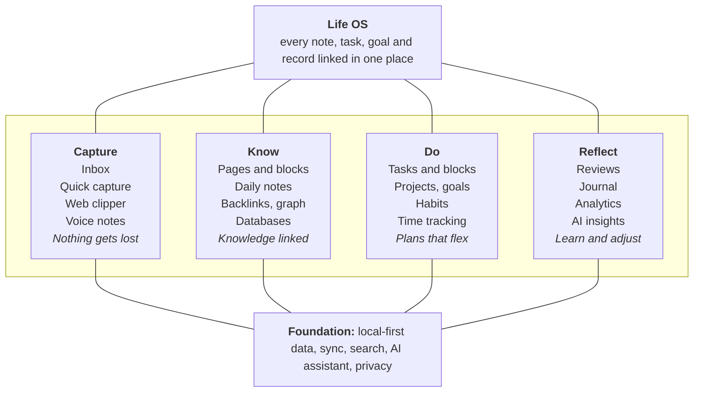
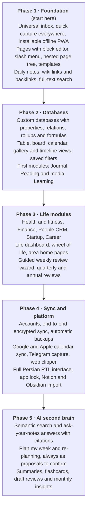

# Personal OS → Second Brain & Life OS: Feature Roadmap

_As of 2026-09-28 · Mahdi_

## Vision

Personal OS should grow from a planner into one place where you **capture** everything, **organise** knowledge, **plan and execute** work, and **reflect** on your life, with every piece linked to the others.

Today the app is strong on the execution loop: tasks, time blocks, goals, habits, reviews and analytics. What a second brain adds is the _knowledge_ half (notes, pages, links, databases) and the _life_ half (health, money, people, learning), both connected to the plan you already have.

The existing app already covers most of the Do pillar and part of Reflect; this roadmap mainly adds Capture and Know, and ties all four to the same records.

Principles to keep as it grows:

- **Everything is linkable.** A note can mention a task, a project, a person, a book or a day, and each shows its backlinks.
- **One data model, many views.** Tasks, books, workouts and expenses are all records in databases, viewed as tables, boards, calendars or galleries.
- **Capture in seconds, organise later.** Nothing is lost because it had no place to go yet.
- **Local-first and private.** Your life data stays yours; sync and AI are opt-in.
- **Calm, not pressure.** Keep the current rule: plans are hypotheses, missed days are not failures.
- **Propose, then apply.** AI suggests; you confirm.

## Knowledge layer: pages, notes and links

The biggest gap between today's app and Notion is **pages**: free-form documents built from blocks, nested in a tree and linked to everything else.

**Pages and the block editor**

- Block types: text, headings, to-do, bullet and numbered lists, toggle, quote, callout, divider, code, table, image, file, embed, math, and link-to-page.
- Slash menu (`/`) to insert blocks; drag handles to reorder; markdown shortcuts (`#`, `-`, `[]`, `>`).
- Nested pages (a sidebar tree), page icons and covers, favourites, and a recently-viewed list.
- Page templates: meeting notes, book notes, project brief, weekly plan, decision record.
- Inline mentions with `@` for pages, tasks, people and dates; a date mention can create a reminder.
- Version history per page, and a trash with restore.

**Daily notes and journaling**

- A daily note is created automatically for each day, linked from the Today page and the calendar.
- It collects that day's schedule, completed tasks, habits and the daily review, with free space for thoughts.
- Weekly and monthly notes roll up the daily ones.

**Linking and discovery**

- `[[wiki links]]` and backlinks: every page, task, project and person shows what links to it.
- A graph view of how notes, projects and areas connect, filterable by tag or area.
- Unlinked mentions: pages that name something without linking it yet.
- Full-text search across everything, with filters (type, area, date, tag).

**Structure for a second brain**

- **PARA** out of the box: Projects and Areas already exist; add Resources (topics you collect for) and Archive.
- Optional **Zettelkasten** notes: small atomic notes with IDs, linked into chains of ideas.
- **Progressive summarisation**: highlight, then bold, then write a summary at the top of a note.
- Spaced-repetition review of notes you mark as worth remembering, which pairs well with learning frontend and AI.

## Databases and views

Custom databases are what make it feel like Notion: you define a collection (books, workouts, expenses, ideas), its properties, and as many views of it as you like. Tasks and projects become built-in databases on the same engine.

**Properties**

- Text, number, select, multi-select, status, date and date range, checkbox, URL, email, phone, file, person.
- **Relation** (link records across databases) and **rollup** (sum, count or average through a relation).
- **Formula** (e.g. `pages read / total pages`), created and edited time, auto-numbered ID.
- Add custom properties to built-in types too, e.g. an "energy" or "difficulty" field on tasks.

**Views**

| View | Best for | Notes |
| --- | --- | --- |
| Table | Editing many records | Inline edit, sort, filter, group, column totals |
| Board | Status and pipelines | Drag cards between columns (reading list, job applications) |
| Calendar | Anything with a date | Reuses the existing Shamsi/Gregorian calendar |
| Timeline | Projects and milestones | Gantt-style bars with dependencies |
| Gallery | Visual collections | Book covers, recipes, mood boards |
| List | Quick scanning | Compact, mobile-friendly |
| Chart | Trends in a database | Count or sum by property, over time |

- Saved filters, sorts and groupings per view; linked views of the same database embedded inside any page.
- Database templates (e.g. a new book record gets a notes page with sections).
- Import from CSV and Notion export; export any view as CSV.

## Life modules

Each module is a ready-made database, page templates and a small dashboard, installable from a module gallery and switchable off. They all link to areas, goals, tasks and daily notes, so a workout counts toward a Health goal and a book shows up in the weekly review.

| Module | What it tracks | Key features | Connects to |
| --- | --- | --- | --- |
| Journal | Daily entries, mood, energy, gratitude | Prompts, mood and energy charts, "on this day" memories, private lock | Daily notes, reviews |
| Health and fitness | Workouts, yoga, sleep, weight, water, meals | Workout logger with sets and reps, sleep vs energy chart, streaks | Health area, habits, goals |
| Learning | Courses, topics, skills, resources | Skill tree (JavaScript, TypeScript, React, AI…), study sessions, flashcards | Frontend area, time tracking, goals |
| Reading and media | Books, articles, podcasts, movies, games | Reading list board, pages-per-day progress, highlights and quotes, ratings | Book goal, Entertainment area |
| Finance | Income, expenses, budgets, subscriptions, savings goals | Categories, monthly budget vs actual, recurring bills, net worth; in toman or dollars | Goals, monthly review |
| People (personal CRM) | Friends, family, mentors, contacts | Last contact, "reach out every N weeks", birthdays (Shamsi-aware), notes per meeting | Tasks, calendar, daily notes |
| Startup / work | Ideas, experiments, customers, metrics, decisions | Idea inbox with scoring, experiment log, decision records, KPI tracking | Startup MVP project |
| Career | Applications, interviews, portfolio, skills gaps | Job pipeline board, interview prep notes, resume versions | Career area, learning |
| Home and life admin | Chores, documents, warranties, shopping | Recurring chores, document vault with expiry reminders | Tasks, notifications |
| Travel | Trips, packing lists, itineraries | Trip pages with checklists and day-by-day plan | Calendar, finance |
| Recipes and meals | Recipes, meal plans, grocery lists | Weekly meal plan generating a shopping list | Health, home |
| Ideas and wishlist | Future projects, things to buy, bucket list | Capture now, review monthly, promote an idea into a project | Inbox, projects |

**Cross-module features**

- A **Life dashboard** showing a wheel of life (score per area), the balance of time across areas, and each module's key number.
- **Life areas** get their own home page gathering that area's projects, notes, goals, habits and module records.
- **Year view** with themes, yearly goals and a life calendar (weeks of your life), plus an annual review.

## Planning and execution upgrades

The execution loop already works well; these additions make it deeper without making it heavier.

**Planning**

- **Energy-aware planning:** tag tasks by energy (deep, shallow, admin) and match them to your high-energy hours.
- **Time budgets per area:** "Frontend 8h this week" shown as a filling bar while you plan, not only after.
- **Priority matrix:** Eisenhower (urgent × important) board for the inbox and backlog.
- **OKRs:** objectives with measurable key results, rolling up from goals and projects.
- **Project templates:** e.g. "Learn a new library" creates the standard tasks and milestones.
- **Dependencies on the timeline:** blocked tasks greyed out until their prerequisite is done.
- **Buffer and focus days:** protected blocks the scheduler never fills.

**Doing**

- **Focus mode:** full-screen current task, Pomodoro or custom intervals, distraction list, ambient sound.
- **Checklists inside blocks** and a "now / next / later" strip on mobile.
- **Routines:** morning and evening routine checklists that feed habits.
- **Waiting-for list** and delegated tasks with follow-up dates.

**Reviewing**

- **Guided weekly review wizard:** clear inbox, review each area, check goals, plan next week from a template.
- **Quarterly and annual reviews** with charts pulled automatically.
- **Personal insights:** best hours of the day, most-postponed task types, estimate accuracy by area.
- **Streak-free consistency score** so progress never resets to zero after one missed day.

**Gamification (opt-in, gentle)**

- XP per area, levels and milestones for long-term goals, a monthly "highlights" card; no punishment for missed days.

## Capture everywhere

A second brain only works if capturing takes under five seconds from wherever you are; everything lands in one **Inbox** to sort later.

- **Universal inbox:** tasks, notes, links, images and voice memos in one list, processed with keyboard shortcuts (convert to task, file to project, add to a database, archive).
- **Quick capture everywhere:** the existing `⌘K` quick add, plus a global hotkey in a desktop app and a home-screen widget on mobile.
- **Web clipper:** a browser extension that saves a page, a selection or a highlight with its source URL.
- **Share sheet:** install the app as a PWA so "Share → Personal OS" works from any phone app.
- **Voice capture:** record, transcribe (Persian and English), then turn into a note or task.
- **Email-in address:** forward newsletters or receipts to a private address that files them into the inbox.
- **Scan and OCR:** photograph a whiteboard, receipt or book page and make the text searchable.
- **Read-later queue:** clipped articles with a clean reader view and highlights that flow into notes.
- **Inbox zero ritual:** a daily 5-minute processing prompt that feeds the daily review.

## AI layer

AI should act as a thinking partner over your own data, and it always follows the app's existing rule: it **proposes** changes, you **confirm**, then they **apply**.

**Ask your second brain**

- Chat over all notes, tasks, reviews and journal entries, with answers that cite the pages they came from.
- Semantic search: find a note by meaning ("that idea about onboarding friction"), not just keywords.
- Related notes suggested while you write, and auto-suggested links and tags.

**Planning assistant**

- "Plan my week" from goals, deadlines, energy and last week's actuals, shown as a proposal to review.
- "I only have 4 hours today": re-prioritise and move the rest, again as a proposal.
- "What's blocking my weekly goals?" and "How much did I spend on frontend this month?" answered from analytics.
- Break a big task into subtasks with estimates.

**Writing and summarising**

- Summarise a long note, article, meeting or book highlights; turn notes into a flashcard deck.
- Draft the weekly review from the week's data, for you to edit.
- Monthly "letter to yourself": what went well, patterns, suggestions.
- Translate between Persian and English inside notes.

**Privacy controls**

- Per-area switch for what AI may read (e.g. keep Journal and Finance private).
- Clear display of what was sent, a local-model option later, and no training on your data.

## Platform, sync and integrations

A life OS has to be on every device and never lose data, so sync, offline use and backups come before most new modules.

| Area | Features |
| --- | --- |
| Accounts and sync | Sign-in, end-to-end encrypted cloud sync, conflict-free merging (CRDT) so offline edits on phone and laptop both survive |
| Offline and PWA | Installable app, full offline use, background notifications via a service worker, home-screen widgets |
| Mobile | Mobile-first capture, swipe actions on tasks, bottom-sheet editors; later native apps (e.g. Expo) |
| Calendar sync | Two-way Google and Apple calendar sync; external events shown as busy time on the timeline |
| Integrations | GitHub (issues and commits into projects), Telegram bot for capture, Google Drive and Dropbox attachments, Readwise and Kindle highlights, health data (Apple Health, Google Fit) |
| Import and export | Notion, Obsidian and Todoist import; markdown export of every page; full JSON backup (exists today); automatic scheduled backups |
| Security and privacy | App lock with PIN or biometrics, encrypted private areas (journal, finance), audit of AI access, data stays local by default |
| Sharing | Publish a page as a public link, share a project with a collaborator, comments on pages |
| Localisation | Full Persian (RTL) interface on top of today's Shamsi dates, plus English |
| Extensibility | Plugin API and public REST API, webhooks, custom themes and CSS, keyboard-shortcut editor |

## Prioritised roadmap

Build the knowledge foundation first: capture, pages and links make every later module more useful, while AI pays off only once there is data to think with.

Each phase ships something usable on its own. Sync moves earlier (right after Phase 1) if you start using the app daily on both phone and laptop, because local-only data is the biggest risk once notes pile up.

**Quick wins** that fit inside the current app before Phase 1 is finished:

- [ ] Inbox page and a "capture to inbox" default in `⌘K`
- [ ] Notes field on tasks rendered as markdown, with `[[links]]` to other tasks
- [ ] Daily note text box on the Today page, saved per day
- [ ] Reading list board (a first simple database) linked to the Book goal
- [ ] Installable PWA manifest and service worker for offline use

## Architecture notes

The current codebase already has the right seams (a storage-agnostic `DataStore`, services, pure logic in `lib/`, Zod schemas), so these features extend it rather than replace it.

1. **Add a generic content model next to the existing one.**
    - `Page` = a tree of `Block`s (type, content, parent, order key), stored per page.
    - `Database` = a schema of properties; `Record` = a row of values, optionally with a page body.
    - Keep `Task`, `ScheduleBlock`, `Goal` and `Habit` as first-class types, and expose them through the same views as built-in databases.
2. **One `Link` table** (from, to, kind) written on save, which powers backlinks, the graph, mentions and relations.
3. **Editor:** use a block-editor library (BlockNote, TipTap or Lexical) instead of building one; store its JSON as blocks.
4. **Search:** a client-side index (MiniSearch or FlexSearch) in a Web Worker now; add embeddings for semantic search in the AI phase.
5. **Files:** attachments in OPFS or IndexedDB blobs locally, object storage (S3-compatible) once sync exists.
6. **Sync:** move from plain IndexedDB to a local-first sync engine (Yjs or Automerge for page content; ElectricSQL, PowerSync or Replicache for records) backed by PostgreSQL, implemented as a new `DataStore`.
7. **Schema migrations:** add a version to every stored entity and a migration runner, since old exports and devices will carry older shapes.
8. **Modules as packages:** each life module = its database schemas, templates, dashboard widget and optional analytics, registered in one place so it can be turned on or off.
9. **AI boundary:** one service that builds context from allowed areas only and returns `PlanChange` proposals, reusing the existing confirm-and-apply flow.
10. **Performance:** virtualised lists and tables, lazy-loaded page content, and background indexing so the app stays fast with thousands of notes.
