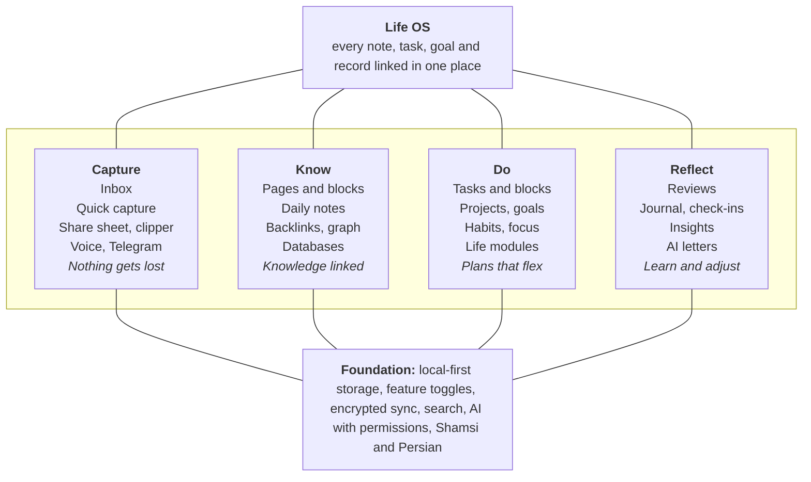
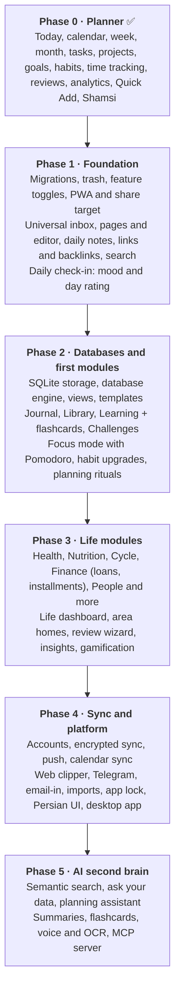

# Personal OS → Second Brain & Life OS: Roadmap

_As of 2026-10-02 · Mahdi_

## Vision

Personal OS should grow from a planner into one place where you **capture** everything, **organise** knowledge, **plan and execute** work, and **reflect** on your life, with every piece linked to the others.

Today the app is strong on the execution loop: tasks, time blocks, goals, habits, reviews and analytics. What a second brain adds is the _knowledge_ half (notes, pages, links, databases) and the _life_ half (health, money, people, learning), both connected to the plan you already have.

**Where Personal OS can lead:** no app today combines Notion-style knowledge, Sunsama-style planning, Exist-style self-tracking and YNAB-style money in one private, local-first graph, and none treats Shamsi dates and Persian text as first-class. See the [competitive analysis](research/competitive-analysis.md).

## Principles

- **Everything is linkable.** A note can mention a task, a project, a person, a book or a day, and each shows its backlinks.
- **One view engine, many records.** Tasks, books, workouts and expenses all appear as databases with table, board, calendar and chart views.
- **Capture in seconds, organise later.** Nothing is lost because it had no place to go yet.
- **Only what you use.** Every module and optional feature can be turned on or off in Settings; off means hidden, never deleted.
- **Local-first and private.** Your data stays on your device; sync is end-to-end encrypted; AI only sees what you allow.
- **Calm, not pressure.** Plans are hypotheses; missed days are not failures; no punishment mechanics.
- **Propose, then apply.** Bulk changes, automations, imports and AI all propose; you confirm.
- **Persian-first, not Persian-also.** Shamsi periods, Persian search and input, mixed-direction text in every feature.

## Documentation map

| Doc | What it answers |
| --- | --- |
| This roadmap | Why, and in what order |
| `/roadmap` in the app | The interactive version: every feature by phase, today vs any phase, generated from the catalogue |
| [Development plan](DEVELOPMENT_PLAN.md) | How to build it step by step: milestones per phase in dependency order, PR-sized tasks for Phase 1 |
| [Feature catalogue](features/README.md) | What exactly: every feature with an ID, priority, phase and status |
| ↳ [Knowledge](features/knowledge.md) · [Databases](features/databases.md) · [Planning](features/planning.md) · [Life modules](features/life-modules.md) · [Capture](features/capture.md) · [AI](features/ai.md) · [Platform](features/platform.md) | The catalogue by domain |
| [Technical docs](technical/README.md) | How: architecture, data model, storage and sync, editor, search and AI, modules and feature flags, security, quality, and the "adding a feature" checklist |
| [Decision records](technical/README.md#architecture-decision-records) | Why we chose SQLite, BlockNote, encrypted change-log sync, typed modules and proposal-based AI |
| [Competitive analysis](research/competitive-analysis.md) | What the best apps do, what we adopt, and full Yasiplann coverage |

## Feature toggles

Every module and optional feature has a switch in **Settings → Features** (PL-01…PL-08). Turning a feature off hides its navigation, pages, widgets, review prompts, analytics, notifications, Quick Add grammar, commands and AI tools; its data stays and comes back when you turn it on. A new install starts with the core planner plus Journal, Library, Learning and Challenges; sensitive modules (Cycle, Finance) start off, and onboarding presets ("Planner only", "Student", "Health focus", "Founder", "Everything") set many switches at once. Design: [modules and feature flags](technical/modules-and-feature-flags.md).

## Phases

Build the foundation first: data safety, toggles, capture, pages and links make every later module more useful, and AI pays off only once there is data to think with.

Each phase ships something usable on its own. The [development plan](DEVELOPMENT_PLAN.md) breaks every phase into milestones and tasks. **Sync moves earlier** (right after Phase 2) if you start using the app daily on both phone and laptop, because local-only data is the biggest risk once notes pile up; the encrypted backups in Phase 2 reduce that risk until then.

### Phase 1 · Foundation

**Goal:** the app is safe to grow, captures anything, and holds notes linked to the plan.

| Track | Features |
| --- | --- |
| Data safety | Schema versions and migrations (PL-10), persistent storage (PL-11), trash and soft delete (KN-11), undo (PL-17) |
| Toggles | Settings → Features, hide-not-delete, dependencies, defaults, presets (PL-01…PL-08) |
| App | Installable PWA with offline shell (PL-20), share target (CA-11), app shortcuts (CA-12), RTL-ready layout rules (PL-61) |
| Capture | Universal inbox and keyboard processing (CA-01…CA-03), mobile capture sheet (CA-10), paste and drop (CA-14), brain dump (LM-JRN-07) |
| Knowledge | Pages, tree, core blocks, slash menu, drag handles, to-do → task, mixed-direction text (KN-01…KN-07, KN-17), daily notes (KN-30, KN-33) |
| Links and search | Wiki links, mentions, backlinks, tags (KN-20…KN-22, KN-24), Persian-aware full-text search (KN-25, PL-63) |
| Check-in | Mood log and day rating (LM-JRN-01, LM-JRN-02) |

**Done when:** you can capture from the phone's share sheet offline, process the inbox into tasks and pages, write a daily note that shows the day's plan, link it to tasks and projects, find anything with `⌘K` in Persian or English, and turn modules on and off without losing data.

**Spikes first:** the editor RTL spike ([ADR-0002](technical/adr/0002-block-editor.md)) and the migration runner.

### Phase 2 · Databases and first modules

**Goal:** structured knowledge and the first life modules, on storage that scales.

| Track | Features |
| --- | --- |
| Storage | SQLite (WASM, OPFS) in a data worker ([ADR-0001](technical/adr/0001-sqlite-wasm-storage.md)), local snapshots (PL-12), markdown/CSV export (PL-15) |
| Databases | Properties, relations, rollups, formulas, record pages (DB-01…DB-10), table/board/calendar/list/gallery views, filters, linked views (DB-20…DB-30), templates (DB-40), CSV import/export (DB-50, DB-51) |
| Knowledge | Rich blocks, templates, history, block references, unlinked mentions, graph, inline queries (KN-06…KN-16, KN-23, KN-26, KN-28), weekly and monthly notes (KN-31) |
| Modules | Journal (LM-JRN-…), Library (LM-LIB-…), Learning and flashcards with FSRS (LM-LRN-…), Challenges (LM-CHL-…), read-later and highlights (CA-20…CA-24) |
| Planning | Morning and shutdown rituals (PE-01, PE-02), workload warnings (PE-05), auto-schedule proposal (PE-10), recurrence upgrades (PE-16), focus mode and Pomodoro (PE-30…PE-33), routines (PE-34), habit upgrades (PE-40…PE-45), year in pixels (RV-25) |

**Done when:** you can track your reading list as a board linked to the Book goal, study with flashcards made from your notes, run a monthly challenge, plan a day with the ritual and focus with Pomodoro, and a 50k-record database stays within the [performance budgets](technical/quality.md#performance-budgets).

### Phase 3 · Life modules

**Goal:** the whole life in one place, and insight across it.

| Track | Features |
| --- | --- |
| Modules | Health (LM-HLT-…), Nutrition (LM-NUT-…), Cycle (LM-CYC-…), Finance with loans, installments and bank SMS import (LM-FIN-…), People (LM-PPL-…), Startup, Career, Home, Travel, Recipes, Ideas |
| Databases | Timeline and chart views (DB-25, DB-26), automations, forms (DB-42, DB-44) |
| Reflect | Review wizard, monthly/quarterly/annual reviews (RV-01…RV-03), correlations and patterns (RV-20, RV-21), life dashboard and area homes (RV-22, RV-23) |
| Planning | Energy-aware planning (PE-07), waiting-for (PE-09), goal hierarchy and OKRs (PE-14), life calendar (PE-15) |
| Gamification | XP, levels, XP modes, streak counter (PE-50…PE-54), all opt-in |
| Knowledge | Canvas (KN-40), outliner mode (KN-14), second-brain methods (KN-51…KN-53) |

**Done when:** the monthly review shows goals, challenges, mood, sleep, weight, budget vs actual and books finished on one screen, and insights find at least one real pattern from three months of data.

### Phase 4 · Sync and platform

**Goal:** every device, never lose data, private by construction.

| Track | Features |
| --- | --- |
| Sync | Accounts, end-to-end encrypted sync, offline merge, devices, recovery (PL-40…PL-44) ([ADR-0003](technical/adr/0003-encrypted-change-log-sync.md)) |
| Security | App lock, module locks, privacy dashboard, local-only modules (PL-45…PL-48) |
| Reach | Web Push (PL-21), calendar sync (PL-30), web clipper (CA-30), Telegram (CA-31), email-in (CA-32), cloud backups (PL-13) |
| Data | Imports from Notion, Obsidian, Logseq, Todoist, Anki, Daylio (PL-16), integrations (PL-31…PL-35) |
| Apps | Full Persian interface (PL-62), desktop app (PL-70), sharing (PL-55, PL-56), plugin API (PL-50) |

**Done when:** edits made offline on phone and laptop merge correctly (verified by convergence tests), the server holds only ciphertext, and reminders arrive with the app closed.

### Phase 5 · AI second brain

**Goal:** an assistant that knows your life (only what you allow) and helps you think and plan.

| Track | Features |
| --- | --- |
| Find | Semantic search, related notes, link suggestions (AI-01…AI-04) |
| Ask | Chat over your data, data questions with real numbers, page actions, daily brief (AI-10…AI-13) |
| Plan | Plan my week, re-plan today, task breakdown, goal coach (AI-20…AI-23) |
| Write and learn | Summaries, extraction, flashcard generation, review drafts, monthly letter, translation (AI-30…AI-37) |
| Capture | Voice capture and OCR (CA-33, CA-34), inbox processing proposals (CA-06) |
| Agents | MCP server in the desktop app (AI-40), scheduled AI jobs (AI-41), database autofill (DB-45) |
| Control | Permissions, request log, model choice, on-device options, limits (AI-50…AI-55) ([ADR-0005](technical/adr/0005-ai-proposals-and-privacy.md)) |

**Done when:** "How many hours did I spend on Frontend in Mehr, and what should I change next week?" gets a correct, cited answer and a plan proposal you can apply, without any journal, finance or cycle data leaving the device unless you allowed it.

## Quick wins

Small things that fit inside the current app before Phase 1 is finished:

- [ ] Inbox page and a "capture to inbox" default in `⌘K` (CA-01, CA-03)
- [ ] Mood and 1–5 day rating in the daily review, next to the existing energy rating (LM-JRN-01, LM-JRN-02)
- [ ] A Settings → Features page with the first switches, built on today's `hiddenNav` (PL-01)
- [ ] Daily note text box on the Today page, saved per day (KN-30, first step)
- [ ] Notes field on tasks rendered as markdown, with `[[links]]` to other tasks (KN-20, first step)
- [ ] Installable PWA manifest and service worker for offline use (PL-20)
- [ ] `navigator.storage.persist()` request and storage usage in Settings → Data (PL-11)

## Architecture in brief

The codebase already has the right seams: a storage-agnostic `DataStore`, services, pure logic in `lib/`, Zod schemas and the propose → confirm → apply flow. The target adds a data worker running SQLite, a change feed that drives indexes, undo, sync and automations, a feature registry for modules and toggles, and later a thin server for encrypted sync, push, capture and AI. Full details: [architecture](technical/architecture.md).
