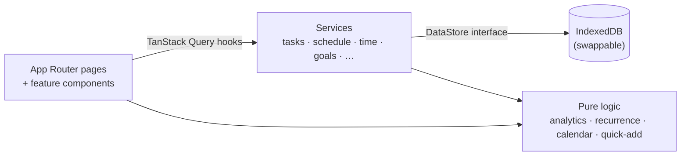
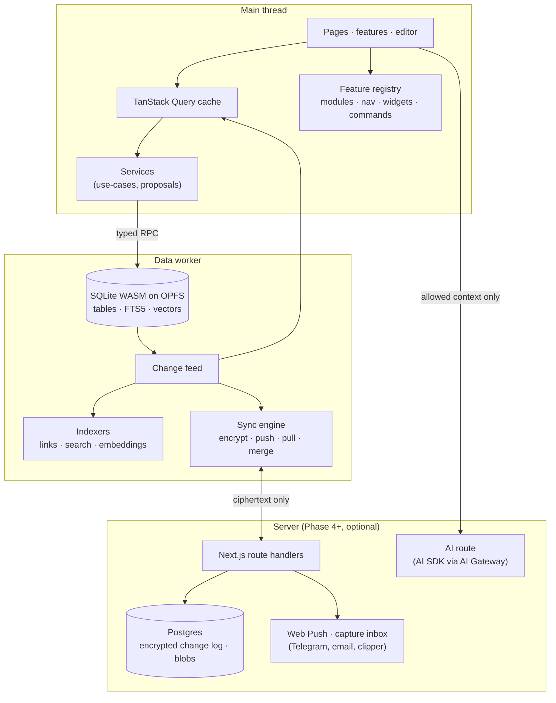

# Architecture

_Current state and target state · see also [data model](data-model.md), [storage and sync](storage-and-sync.md)_

## Today

Personal OS is a client-only Next.js 16 app (App Router, React 19, TypeScript strict). All data lives in the browser's IndexedDB. There is no server and no account.



| Layer | Location | Rule |
| --- | --- | --- |
| Pages | `src/app/` | Thin; render a feature view |
| Features | `src/features/<feature>/` | UI and feature-specific hooks; no storage access |
| Shared UI | `src/components/` | shadcn/ui on Radix, layout, shared widgets |
| Hooks | `src/hooks/` | TanStack Query hooks; optimistic updates for drag and drop |
| Services | `src/services/` | Use-cases over the `DataStore`; validate, enforce rules, write |
| Repositories | `src/repositories/` | `DataStore` interface with IndexedDB and in-memory implementations |
| Pure logic | `src/lib/` | Dates and calendars, analytics, recurrence, scheduling, Quick Add parser; fully unit-tested |
| Types | `src/types/domain.ts` | Zod schemas for every entity |
| UI state | `src/store/` | A tiny selector store for UI-only state |

Key ideas that every new feature should keep:

- **Task vs block.** A task is the work; a schedule block is when it's planned. One task, many blocks.
- **One source of truth for time.** Completed blocks and timer entries are combined in one place (`lib/analytics/work.ts`), so nothing counts twice.
- **Propose → confirm → apply.** Bulk changes are built as `PlanChange[]` (`lib/planning/changes.ts`), shown, confirmed, then applied.
- **Derived over stored.** Progress, streaks and stats are computed from records, not stored, so they can't drift.

## Target

The target keeps the same layers and adds five pieces: a data worker, a change feed, indexers, a feature registry and (later) a small server for sync, push and AI.



### Data worker

All storage runs in a dedicated Web Worker that owns a SQLite database on OPFS ([ADR-0001](adr/0001-sqlite-wasm-storage.md)). The main thread talks to it through a typed RPC (e.g. Comlink) that implements the existing `DataStore` interface, so services and UI don't change. Heavy work happens in the worker: queries for database views, full-text search, link indexing, embeddings, sync and backups.

### Change feed

Every write goes through one function in the worker that records a `Change` (`{ entity, id, fields, hlc, origin }`) in the same transaction as the write. The change feed then:

1. tells the main thread which query keys to invalidate (replacing ad-hoc invalidation in hooks);
2. updates the link index and search index for that entity;
3. queues an encrypted change for sync, when sync is on;
4. feeds automations (DB-42) and the undo stack.

Because every write produces a change, undo, sync, indexing and automations all get the same view of what happened.

### Feature registry

A single registry (`src/modules/registry.ts`) lists every feature and module: its toggle, default, dependencies, privacy class, collections, routes, nav items, widgets, review prompts, analytics, notifications, Quick Add grammar and Command Center actions. The shell, dashboard, reviews and Command Center read from it instead of hard-coded lists. See [modules and feature flags](modules-and-feature-flags.md).

### Indexers

Indexers rebuild derived tables from the change feed, in the worker, in the background:

| Indexer | Builds | Used by |
| --- | --- | --- |
| Links | `links` table from page content and record relations | Backlinks, graph, unlinked mentions, mentions in People timelines |
| Search | FTS5 tables with Persian-normalised text | `⌘K`, search page, inline queries |
| Embeddings | Vector chunks (Phase 5) | Semantic search, related notes, AI context |

Indexes can always be rebuilt from source records, so they are never synced or backed up.

### Server

The app stays usable without a server. A server is added in Phase 4 for things a browser can't do alone: sync between devices, Web Push while the app is closed, receiving captures from Telegram, email and the web clipper, calendar OAuth, and calling hosted AI models. It is implemented as Next.js route handlers deployed with the app, plus Postgres and blob storage. The server only ever stores ciphertext for user data (see [ADR-0003](adr/0003-encrypted-change-log-sync.md)).

## Folder layout (target)

```
src/
  app/                 thin pages (+ app/api/* route handlers from Phase 4)
  features/            UI per feature: pages, inbox, journal, finance, …
  modules/             module definitions and the feature registry
  components/          shared UI
  hooks/               TanStack Query hooks
  services/            use-cases and proposals
  repositories/        DataStore interface, SQLite worker client, memory store
  worker/              data worker: sqlite, change feed, indexers, sync
  lib/                 pure logic: dates, analytics, recurrence, money, fsrs, text (Persian normalisation), formulas
  types/               Zod schemas
  server/              server-only code: sync store, push, capture, AI (Phase 4+)
```

## Cross-cutting rules

- **Dates** are stored as Gregorian `yyyy-MM-dd` keys and ISO timestamps; Shamsi is a display and period-boundary concern handled by `lib/date`. Every new module uses `lib/date` for "this month", "this week" and pickers.
- **Money** is stored as integers in the currency's smallest unit with a currency code (see [data model](data-model.md#money)).
- **Units** are stored in metric and converted for display.
- **IDs** come from `createId()` (`lib/utils/id.ts`). IDs never encode meaning.
- **Text direction** is decided per block or field from content (`dir="auto"`), never from the UI language.
- **Time** comes from the injected `now()` in `ServiceContext`, so tests are deterministic.
