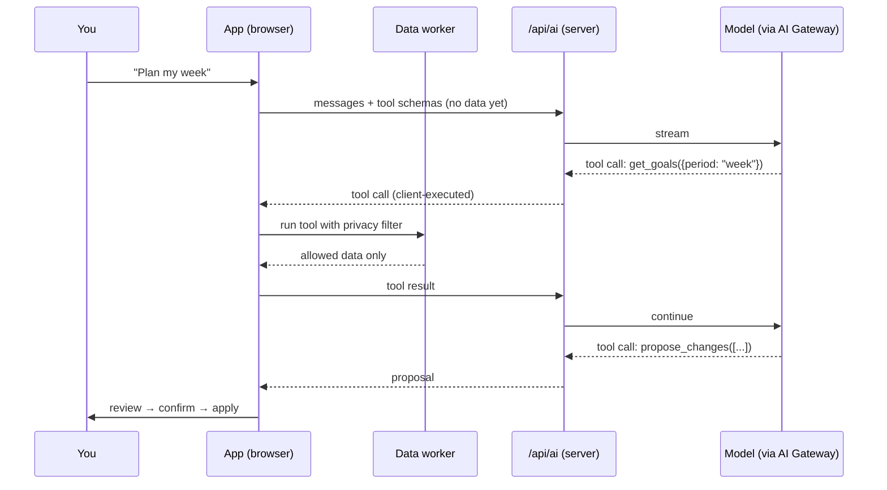

# Search and AI

_See also [ADR-0005](adr/0005-ai-proposals-and-privacy.md), [security and privacy](security-and-privacy.md), [features: AI](../features/ai.md)_

## Full-text search (Phase 1–2)

### Persian-aware normalisation

All text is normalised the same way before indexing and before querying, in `lib/text/normalize.ts` (pure, heavily tested):

| Step | Example |
| --- | --- |
| Arabic → Persian letters | `ي` → `ی`, `ك` → `ک`, `ة` → `ه`, `ؤ` → `و`, `أ/إ` → `ا` |
| Remove diacritics and tatweel | `کِتاب` → `کتاب`, `کـتاب` → `کتاب` |
| Zero-width non-joiner | Index both joined and split forms: `می‌خوانم` matches `میخوانم` and `می خوانم` |
| Digits | Persian `۱۲۳` and Arabic `١٢٣` → `123` |
| Latin | Lowercase, strip accents (NFKD) |

Persian has no reliable stemmer in this stack, so matching relies on prefix search and a trigram index for partial words.

### Index

- **Phase 1 (IndexedDB):** MiniSearch (or FlexSearch) in a Web Worker, built from pages, tasks, projects, goals, inbox items and records; persisted as a serialised index in IndexedDB and updated from the change feed.
- **Phase 2 (SQLite):** FTS5 virtual tables (`unicode61` tokenizer on normalised text, plus a `trigram` table for substring matches). Each row stores `entity type`, `id`, `area`, `tags`, `date` columns for filters.
- Ranking: BM25, boosted for title matches, recency and favourites; results grouped by type in `⌘K`.
- Snippets highlight matched terms in the original (un-normalised) text.

## Semantic search (Phase 5)

| Piece | Choice |
| --- | --- |
| Chunking | Per block group: headings start a new chunk; chunks of ~200–400 tokens; records chunk as "title + properties + body" |
| Embedding model | A small multilingual model that handles Persian well (e.g. `multilingual-e5-small` or similar), run on device with Transformers.js on WebGPU, falling back to WASM; picked in a spike measuring Persian and English recall on our own notes |
| Storage | `Float32Array` vectors in SQLite (BLOB column) with brute-force cosine in the worker, which is fast enough for a personal corpus (~100k chunks); switch to `sqlite-vec` if it isn't |
| Freshness | Re-embed chunks whose text hash changed, in the background, when the device is idle and on power |
| Hybrid ranking | Combine BM25 and vector results with reciprocal rank fusion |

Embeddings are derived data: never synced, rebuilt per device. Sensitive modules are not embedded unless the user allows it.

## AI assistant (Phase 5)

### Where things run

The model runs on a server; your data lives on your device. So the model never gets direct database access. Instead:

- The server route (`src/app/api/ai/route.ts`) uses the AI SDK and streams responses; the model is a setting, routed through AI Gateway with a `"provider/model"` string, or the user's own API key.
- **Tools are declared on the server but executed on the client** (AI SDK client-side tool calls), against the local data worker, after the privacy filter. The server only sees the tool results the client chose to send.
- The server keeps no conversation history beyond the request; history lives on device (and syncs encrypted).

### Tools

| Tool | Returns | Notes |
| --- | --- | --- |
| `search` | Ranked snippets with entity refs | Hybrid search; respects privacy filter |
| `get_entity` | One page, task, record… | Text is truncated to a budget |
| `query_database` | Rows from a view spec (filter, sort, group, aggregate) | How data questions (AI-11) get real numbers |
| `get_analytics` | Results of existing pure analytics functions (time by area, goal progress, habit consistency, spending by category) | Reuses `lib/analytics` so numbers match the app |
| `get_schedule` | Blocks and free slots for a date range | For planning |
| `propose_changes` | A `ChangeProposal` | The **only** way the AI can change anything |

### Proposals

`PlanChange` (`lib/planning/changes.ts`) grows into a general `Change` union covering every entity (create, update fields, move block, link, tag, archive). The AI, rollover, templates, automations and imports all produce `ChangeProposal`s, which the existing review UI renders with per-change checkboxes. Applying a proposal goes through the normal services, so business rules and undo apply.

### Context budget

The client assembles context with a token budget per request: pinned context (today's date in both calendars, settings, area list) first, then tool results, truncated with "…more available" markers so the model can ask for more.

### Evaluation

A small eval set in `e2e/ai-evals/` (questions with expected tool calls and expected numbers from a seeded dataset) runs in CI against a mocked model for tool wiring, and manually against real models before changing the default model or prompts.

## Voice and OCR (Phase 5)

- **Voice:** record with `MediaRecorder`, save the audio as an attachment first (nothing is lost), then transcribe via the server (hosted speech-to-text with good Persian accuracy) or on device with a Whisper model via Transformers.js for private mode. Always show the transcript for editing before turning it into tasks or notes.
- **OCR:** Tesseract.js (Persian and English traineddata) on device for privacy; hosted vision models optionally for handwriting and receipts. Extracted text goes into `attachment.extractedText` and the search index.

## MCP server (AI-40)

An MCP server needs a running process that can read your data. Because data lives on the device and the sync server only holds ciphertext, the MCP server ships with the **desktop app** (PL-70): it reads the local SQLite database through the same data layer, exposes read tools (`search`, `get_entity`, `query_database`, `get_analytics`) and a `propose_changes` tool whose proposals appear in the app's notification centre for confirmation. The same privacy filter applies.
